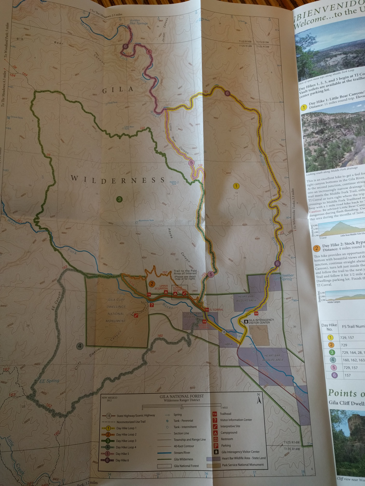
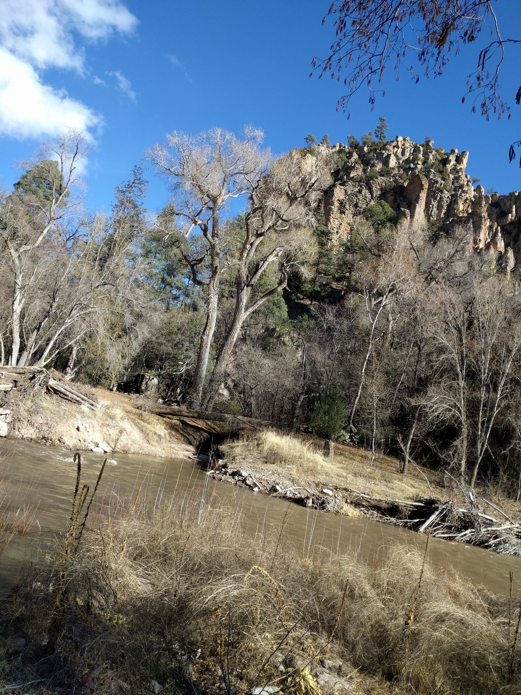
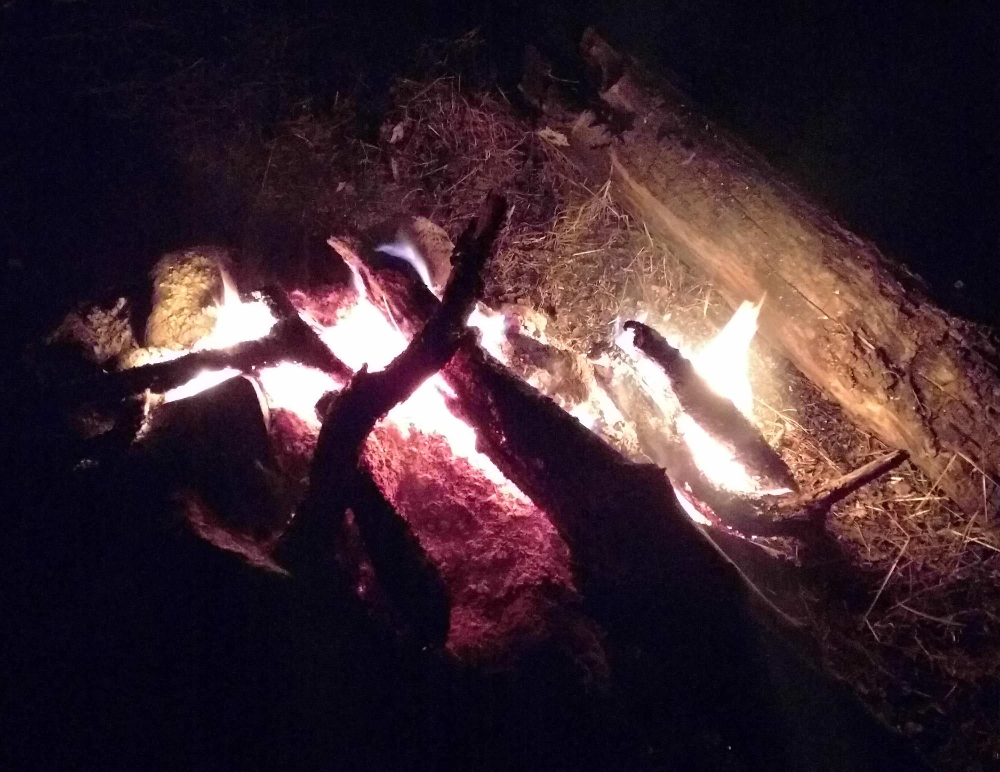
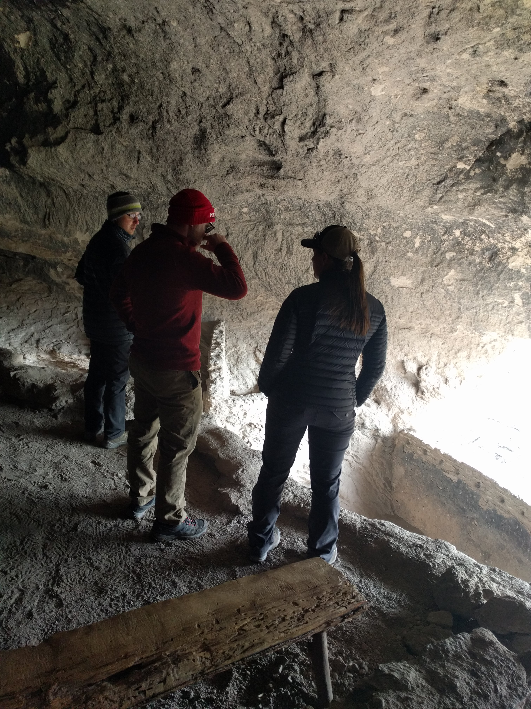
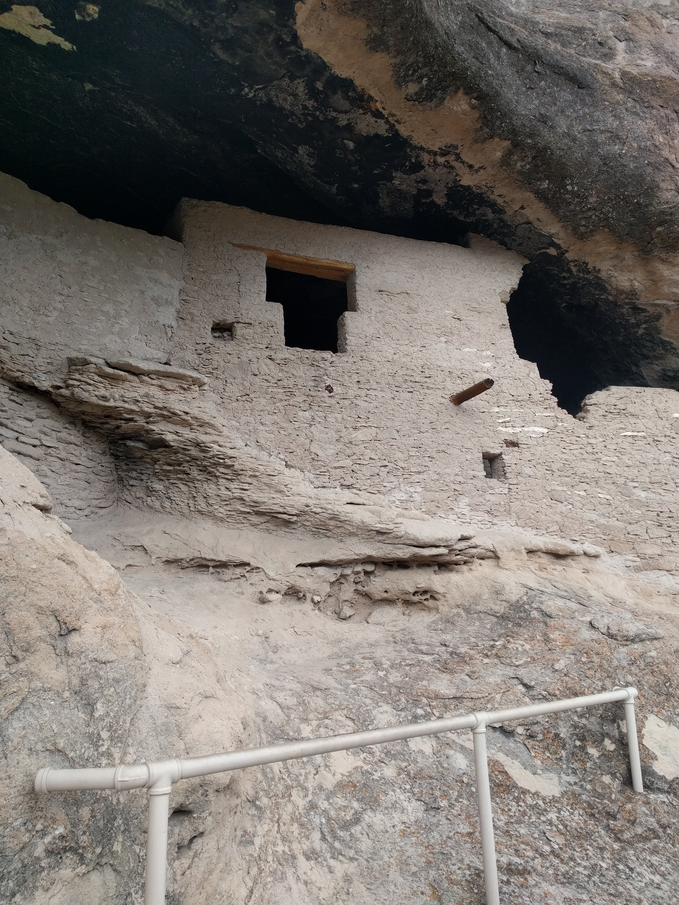
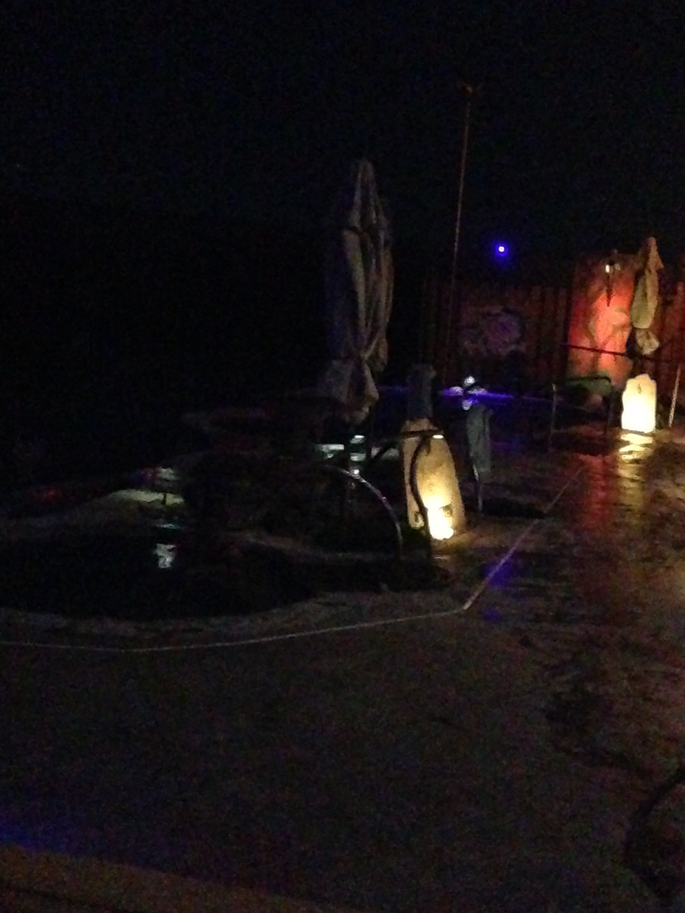

# Misadventures in the Gila Wilderness

This is a tough one to share. Trip reports ought to be inspiring, fun filled, with cute photos of folks posing atop stunning vistas, grinning, arms around shoulders and the look of wood smoke about them.

**This isn't that kind of story.**

I was traveling alone through New Mexico and wanted to see some of the country. A few searches online lead me to "Jordan Creek Hot Springs", a 4 hour hike into the Gila wilderness. They are volcanic warm springs, on the other side of a series of river crossings, seemed perfect. I made my way out there from Cochise Stronghold in Arizona where I had spent the previous evening around a campfire with some climbers, arriving at the trail head for 130pm. Scarfed down left overs, packed my bag and set out with only this photo (taken at the local hiking store) and a compass for any kind of navigational equipment:

So far so good! Beautiful trail, enough light, making great time I passed a group of three with dog coming down the trail. "Yeah, we looked at that river a long while and decided not to make for the Springs. Something something up to 600 CFS something something dog we'll camp some where over here."

"Softies", I concluded, and marched on through Little Bear Canyon, noting only copious amounts of Cougar scat and no sign of of the presumably hibernating bears.

I arrived at the first river crossing, at 4.5 miles, for 3:15pm, recalling dimly reports detailing some 30 knee-thigh high crossings (round trip) to make it to the Springs. The water was definitely high and flowing from the previous night's rain, but I didn't see any threatening rocks so I snacked, slipped on some shorts and sandals (thong style...), fashioned myself a wading pole and hopped in:

The first crossing went smoothly, inspiring confidence. Gosh darn was that water cold as heck though! I figured I could do ten more of those no problem, I carried on, leaving my sandals equipped, my stick in tow.

Another crossing. Another one. Another one. After that one, another one. As soon as my legs quit shivering, another one! At this point the canyon walls steepen, the light fades and I'm just frozen. The water reaches the bottom of my hoodie, my shorts and soaked through, my stick is getting shredded slowly by the rough river bed. I press on. After ten crossings, the inevitable happens and I fall in. I manage to keep my head above water and flail my way to the bank as I watch my sandals float away down river. Gone in an instant. Stubborn, I proceed barefoot, somehow, channeling the childhood nickname "Mogli", earned in similar fashion. At time I trot along, each time the river looms again, relentless. I charge back in, teeth chattering, I fall in again, feel the wetness of my backpack on the small of my back, flail to the far shore, keep going, just keep going.

Then I start to notice something. My thoughts aren't making sense. My feet aren't registering any sensation, I'm stepping on things that I know hurt me, I'm launching myself in to cold water with too much abandon with no promise of sunlight to take the edge off. I am, in fact, delirious.

I don't know much about hypothermia, but I know that it's onset will cause severe confusion, and intense shivering and I was exhibiting both symptoms in spades. To my left, up the embankment are a large herd of boar. I've never seen boar in the wild. I start to think of Oryx and Crake and the genetically enhanced pigs who are super intelligent and hunt in packs. I start to think about dying and that triggered some kind of sober synapse and eventually the clear thought: STOP, and make a huge fire.

Thankfully the brush was dry enough that I was able to get a healthy blaze going very quickly. The chattering took about 45 minutes to calm down. My clothes were soaked, the only top I had was the down coat my mom bought me in Florida two weeks prior! If not for that coat, I don't know that I would have warmed up at all! At least I had wool which I think would have served, plus a gore tex rain jacket to keep the heat in. Either way. Yikes! Eventually got a tea going, made a quinoa dinner (which I spilled about a third of but wtvr), wrapped myself in my sleeping bags and attempted to sleep after listening to 30 min of a recording of Sat Sangah from December I had on my phone with only a light snow coming down overhead.

**Cue the 10pm rustling outside my tent!**

Oh lord. What now. Have I come all this way just to become cougar food? Gripping knife and hatchet, I held fast at my tent door and waited. The rustling near, then far, then gone, still waiting, returns, near again, rustling, I peak out the bottom of the tent fly, paws? Something. The sound fades, stops, heart pounding, bears must be sleeping right? Can only be a cat? Racoon? Boars!? Shrew?!? Who knows. I never will. Given the limited cast of nocturnal creatures in the area and abundant cougar sign, I still think it was a cat of some kind, but it evidently decided to respect whatever perimeter I had created and I thank my lucky stars for that.

Having prayed for sunlight the following day, I woke from maybe 5 hours of sleep to answered prayers and while it was cold out, I changed strategies and made it back without further incident wearing wool long johns, wool socks, running shoes, rain pants and my rain coat. Taking my time at each crossing, I made it back to the first crossing after no less than 16 trips into the water, thoroughly grateful to be alive and back in the sunlight.

On my way back I overtook that group of three. They were quite relieved to see me, eyes widening at my tale. They explained that CFS means cubic feet per second. Incidentally, they are also the owners of the hiking store wherein I got the photo of my map and know a thing or two about the region. That the river was at some 600 CFS, three times its usual. All in all I felt like an absolute idiot. I hadn't even given any friends my itinerary... rule #1 broken, and grossly over estimated the river in February, something I should know better than to mess with. Never even made it to the Springs so after a tour of the National Monument (my year pass got me and my three friends in for free!), I headed to Truth or Consequences and indulged in a hot mineral bath. after a steaming bowl of Thai Curry #worthit

Take aways:

 1. Always tell someone where you're going and when you'll be back
 2. Travel with someone unless you know the terrain very well
 3. Just buy a dang map
 4. Whistle and or bear spray probably not a bad call either
 5. Do some research, especially when dealing with water features. At least check the weather forecast.

These all seem obvious, and yet, I, a fairly seasoned explorer (perhaps more cocky than seasoned?), managed to fail on each and every account. Well, there you go, humility, the greatest lesson of all!

On a deeper level, I feel this trip also presented an inability to be and a fixation on doing. I could easily have set up camp at 3:15, enjoyed the last of the sun, a good meal and quiet time by myself. But I wanted to make it some place, get some where, attain something, build the story of how I made it to the hot springs, fording rivers and traveling for hours on end into the fading light only to arrive at my personal oasis for a night before returning. What a load! Sigh. Much to put down yet. I'll get there. Thanks for reading, love you all.
