# The Elk River Trail to Landslide Lake

July 13th 2019 - Strathcona park

Meet Grace Emiliano and Elisha (photo credits to Em!), three lovely humans (and King Tut the pooch!) who gathered along with myself for a hike up the Elk River trail to Landslide Lake in Vancouver Island's centrally located and sprawling wilderness area known as Strathcona park.

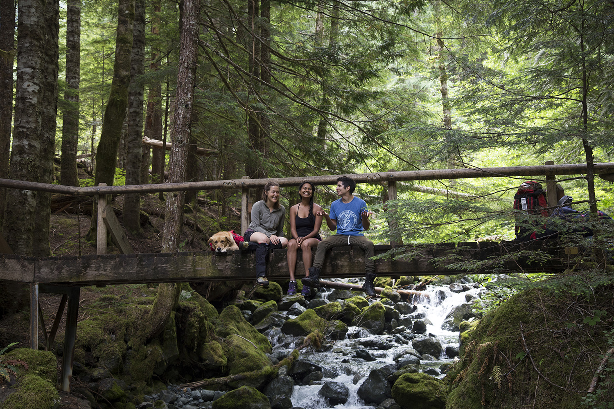
> My 4 lovely companions

My previous forays in Strathcona had either originated to the East at the abandoned ski area of Forbidden Plateau (ominous sounding much?), the active ski area Mount Washington or to spend a few nights camping by Crest Creek Crags, one of Vancouver Island's few climbing destinations (hidden gem alert: this may be the most welcoming crag I've ever been to). I've often looked at the map I have of this area and thought the approach from the North would make for some excellent back packing, though a friend had warned it was rugged! In the end, this trail was totally approachable, likely having been reworked recently as $10/night camping fees have been instated, and proved easy going for its entire 9km length with only a moderate climb towards the end. I suspect the business would start shortly thereafter should one continue into the alpine proper but having reached our objective comfortably we sought no further engagement and instead made camp at the second camping area at kilometer #7, which I believe is simply called Landslide Lake, though it's another 30 min up to the freezing sub alpine glacier fed lake itself.

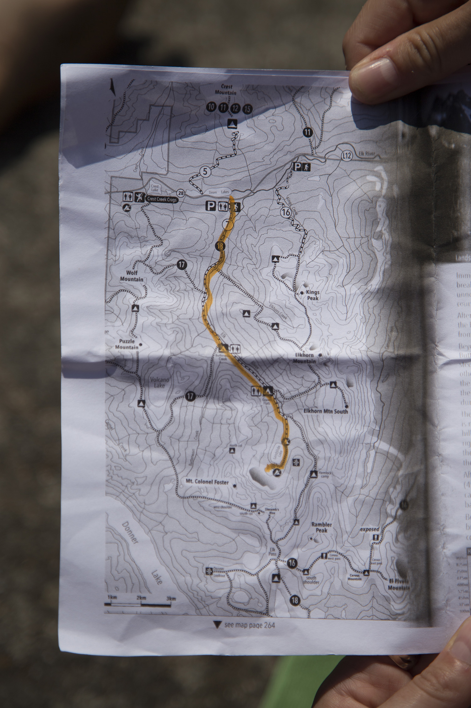
> Route marked in orange, top is highway, lower down is the lake

All in all, there isn't too much to say about this trek except that I had a wonderful time and would totally return to this area and head out with this group again :) The trail was super easy to follow, the huckleberries were out in full force, we saw only a few other parties and I suspect many other routes in and around this area would be as high quality, not to mention there are some great moderate scrambles to be explored in the form of Rambler peak near Mt Colonel Foster.

I'll add that one of the highlights for me was traveling with three fellow yogis. I'd often catch snippets of conversation centering around Dharma, Kundalini, breath and other such topics that delve into Sanskrit words and resonate deeply with my current inward focus in life. It was also a major treat to wake up and have everyone sort of drift into their own spaces to do morning practice, and we also gathered in a single tent one night to learn a Tibetan warrior mantra that I have worked in to my own daily practice. We also pioneered nudity up at the lake, inspiring one party and un-phasing another (Quebecers ;) which was really enjoyable despite the fact that my pasty thighs proved to be badly sun burned the following day! I won't share photos of our time at the lake save one, here's Tut!

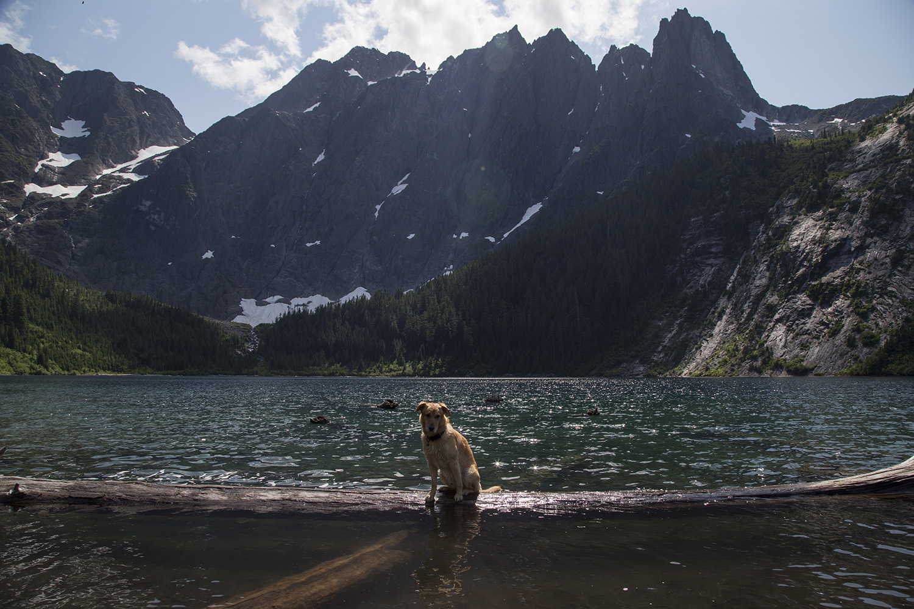
> Regal as his namesake beneath the spires of Colonel Foster at Landslide Lake

Fortunately, photographer Emiliano, equipped with a Canon 6D, was sure to grab many PG13 photos and so I offer these as wonderful reprieve from my own low res phone photography, I'm sure the family will be grateful!

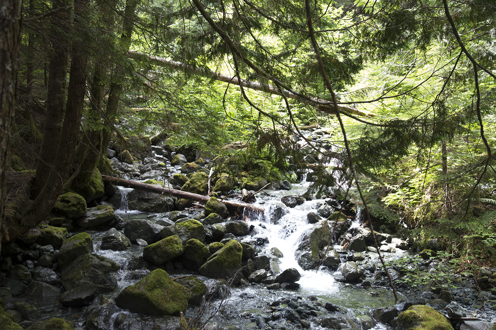

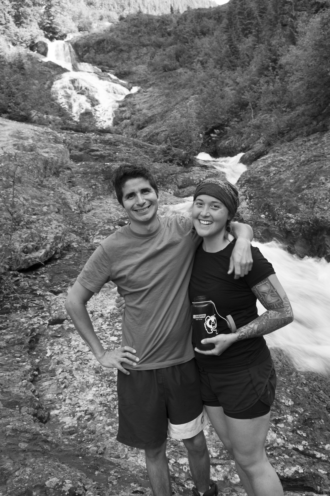
> Grace and Emliano

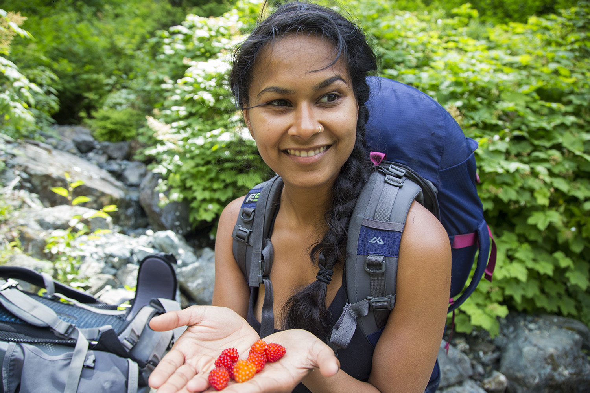
> Berry bounty

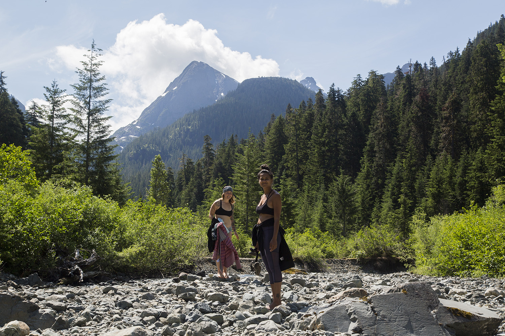
> Upon queens return from morning practice by the river

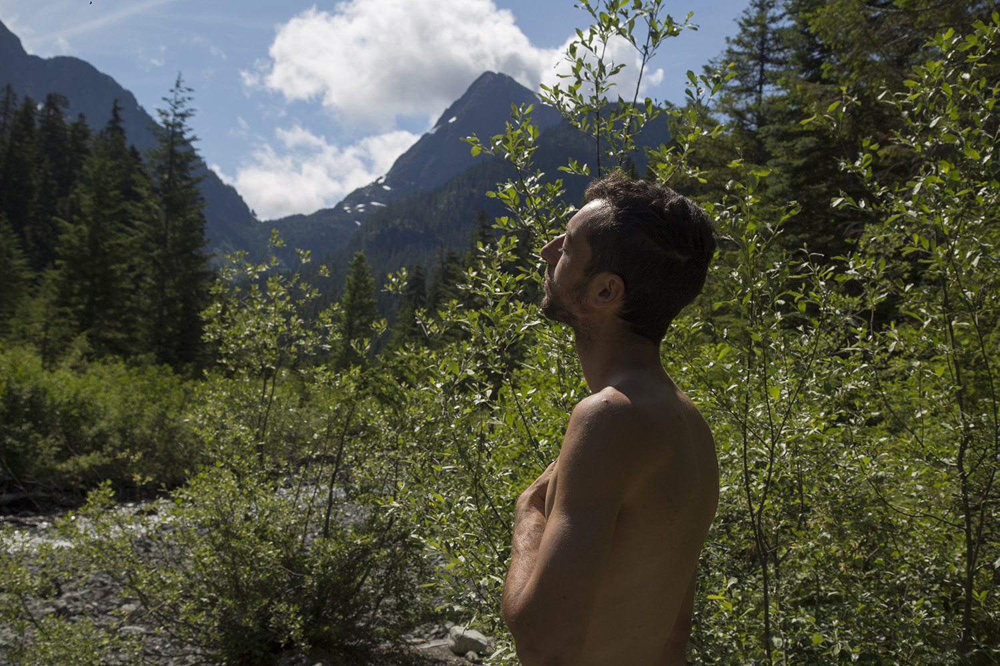

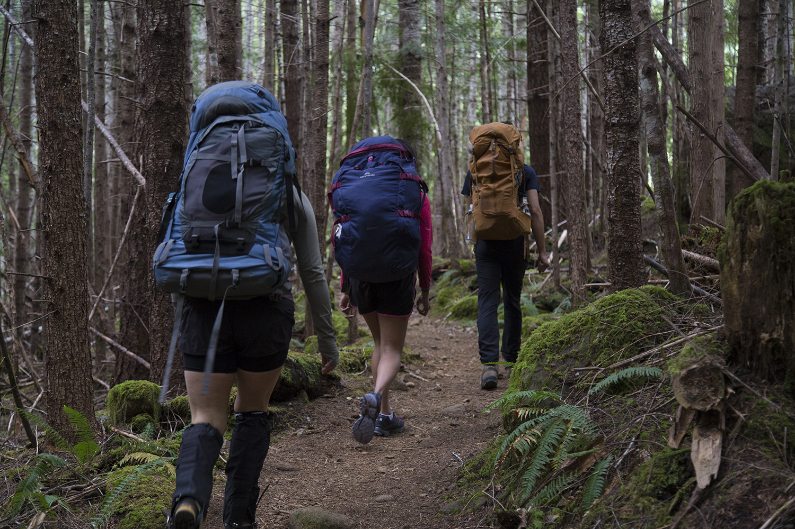

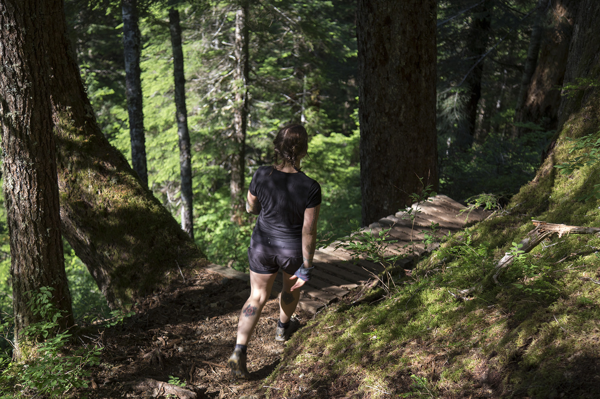

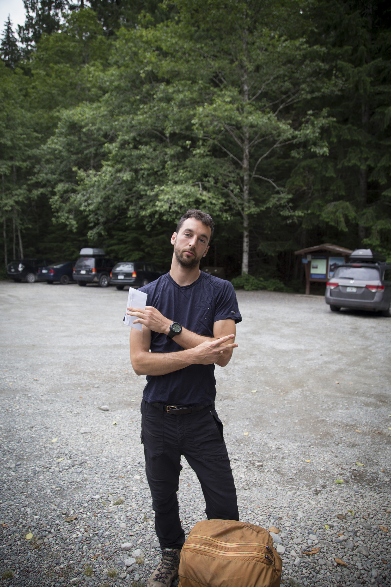
