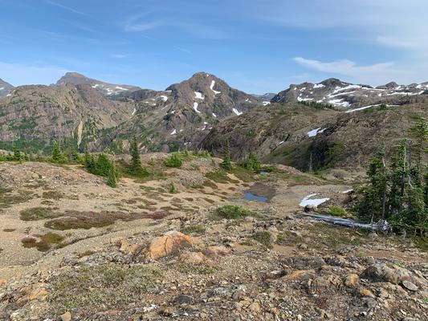
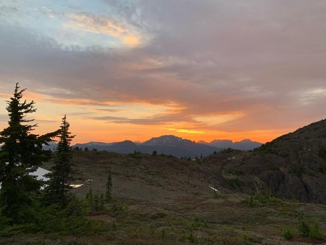
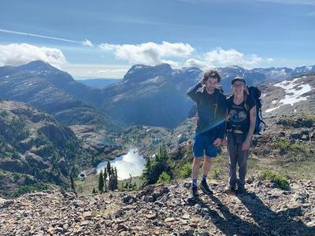
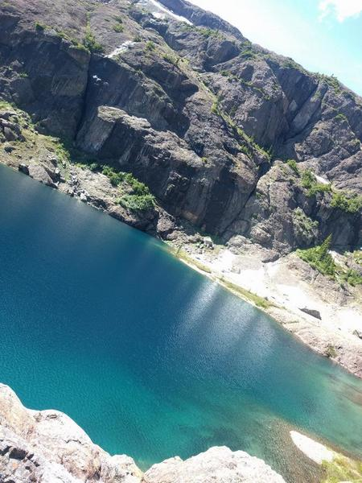
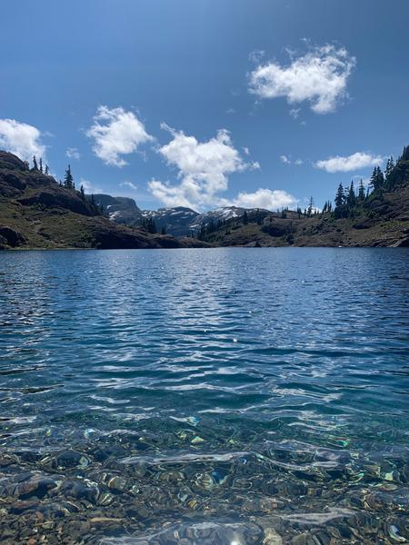
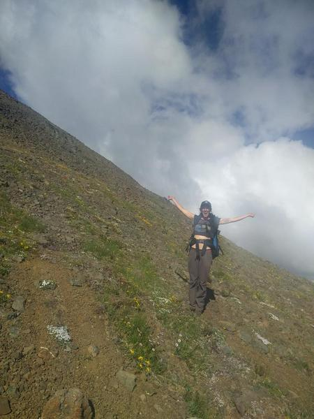
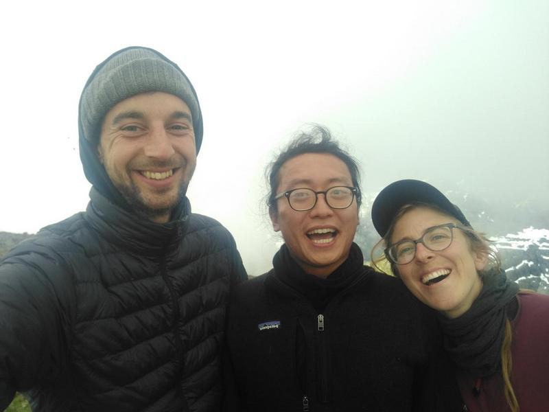

# The Augerpoint Traverse

August 4th 2020 - Unceded Pentlatch Territories

When my friend Lichen proposed a wilderness expedition in the Summer of 2020 as part of a wilderness skillshare. I'd already been on the lookout for a backpacking trip and was super enthused to join him on the Augerpoint Traverse. My partner Robin was also keen and we eventually found a fourth in the form of our mutual friend Julianna who would drive up from Salt Spring to join the expedition early on Friday morning of July 31st. Oh, btw, my birthday was the very next day and I could not wait to turn 31 in the alpine.

Sadly, it was not meant to be that Julianna would make this expedition. She cancelled on the eve of the trip and so we awoke bright and early to the news that one of the vehicles needed for the car shuttle was not going to make it! Some hasty reorganizing later, Lichen's partner Meika drove us in Robin's car to the trailhead on the East side of Buttle lake where a blue arrow made of chalk gave away the start to our trip and the promise of the alpine: the trail to Jack's ridge.

We'd read that this section of the trail was a "knee-knackering" descent, as, indeed, most parties begin at Paradise Meadows at the East end of the traverse and finish by coming down Jack's ridge. To me, it seemed way more aesthetic to start with a slog and end on a gradual ramble through meadows so we left Lichen's truck at the East portal and began the ascent at 11:00am, breaking free of the tree-line shortly after 2:30pm! The way up was steep, about 1km in elevation for as much lateral distance but the presence of blueberry more than made up for it. I'll add that the trail is well built, easy to follow and employs switchbacks to take the brunt of the steepness, a fine way to ascend really.

A charmed interlude: once out of the trees and thoroughly away from civilization, Robin realized they had left the door to Keta the ferret's cage closed! Ah! This meant our furry comrade would have a hard time getting to their food… uh oh! We were in ear shot of a pair of hikers who were lounging by a tarn and readying to make the way down the way we'd just come. I suggested that Robin ask everyone we came across if they had an InReach (satellite phone) and lo and behold! this pair did :) A text message was dispatched to their mum and our spirits were restored; Keta would not go hungry!

Carrying on, we enjoyed a warm stroll through the sub-alpine of Jack's Ridge and aimed for the final bump before the descent to Ruth Master lake, assuming the mosquitoes would be less present at elevation. Before long, our distant objective Mt Albert Edward (hitherto renamed Mt Scythe!) loomed in the distance and a group of peaks emerged betwixt us and that gradual arching summit. We found some flat spots along the trail and set up camp for our first night, ravenously and delightedly scarfing the roast veggies we'd lugged this far along with some fresh made quinoa. We slumbered contentedly through the clear night as the near full moon rang out, a 4am pee break never looked so good.

The next day we continued along the ridge to a high point and proceeded to do some orienteering as befits a wilderness skill share. By shooting bearings at landmarks, we were able to triangulate our position quite accurately, a useful skill whose real world applications can be limited. In sum, it's not often you have a map, compass, recognizable landmarks, good visibility and the need to figure out your location, but hey! Fun nonetheless, and taking a bearing is certainly a good skill when leaving the alpine for a forested and unmarked descent. As an aside, Robin and I had spent about 8 hours totally lost on one such descent from Mt Sloan not three days before leaving for this trip so I speak from some experience.

Our orienteering complete, we descended from the alpine down to Ruth Masters lake, a truly stunning body of water whose depths would have turned Lapis Lazuli blue.

Truly magical, the mosquitoes did agree, however, so after a few dives in to those refreshing waters we pressed on as movement seemed to be our only relief from the tiny winged vampires.
Early afternoon, two runners passed us by! Apparently our 30km wilderness trek doubles as a day trip, maybe next time!? Ascending once more, we gained the summit ridge leading to the top of Scythe Mountain and ambled our way there. Stunning views greeted us; to the West, Buttle lake (surely pronounced Butt-hole) and Augerpoint Mountain with the Golden Hinde and the ranges of the inner island foreboding; the Beaufort ranges amicably arrayed to the South; Mt Washington, various gulf islands and the Georgia Straight to the East and a swath of jagged mountains to the North. Just then, some cloud cover rolled in and the views diminished but we had eyes only for our supper cook pots. For my birthday dinner, I was feasted by Robin's foresight in preparing dehydrated Stroganoff! A family favourite of mine, I was quite delighted and accordingly giddy to turn 31 in such style, surroundings and company. We made camp a short ways down from the summit and enjoyed a sweet evening amidst the heather, the Aquarian full moon resplendent for the onset of Lughnasadh.

The final day we descended on familiar trails out to paradise meadows. Passing many, the trail became more gradual, wide and populated as we went, civilization rising up to meet us. We skipped a short portion of the final kilometre before we realized this was truly untenable with our tired pack laden bodies and so we trudged on to a final group hug at trail's end. Huzzah! Lichen's truck was still there and so we descended from Mt Washington, driving in 10 minutes the distance we had walked for 3 days and arrived at a house-sit where Meika awaited, guiding us to what was probably the most glorious shower of my life not because I'd been away from running water for three days, which was nothing new, but because it was simply a very fancy shower with three different modes including a back massaging water jet option… Sweet!

Dinner at the Cornerstone in Courtenay was festive, cocktail laden and opulent. I started with a Blueberry Cheesecake cup as is my wont, had both a Mule and a Dark and Stormy and left feeling absolutely fantastic (and thoroughly in the passenger seat ;)

A great adventure! A very accessible through hike, I'd highly recommend this outing to anyone looking to introduce themselves to the back country, route finding and overnight treks. Thanks so much for inviting us along Lichen!

