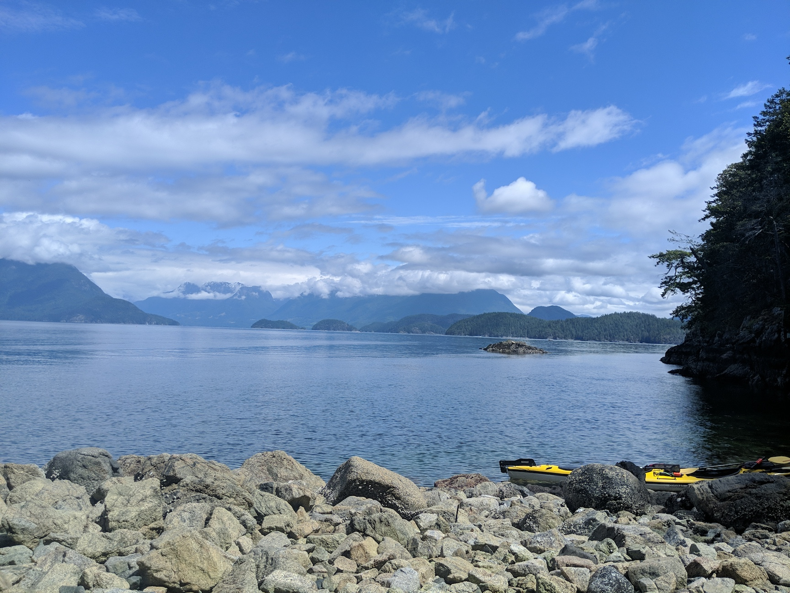
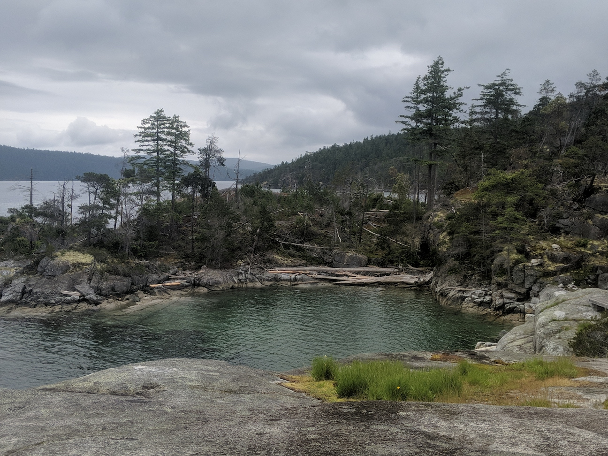

# Desolation Sound

This was my first time ocean paddling... ever! And first time on a multi-day kayak adventure. That said, it's my new favourite thing! As I continue to live a physical existance, my body has some messages for me and one of those is that my knees are not wild about going up and down mountains :/ So the idea of a traveling without the knee knackering ups and downs of backpacking has become increasinly appealing! Thus, kayak touring!

I began emailing around to see what our options were for rentals and settled on Cortes Kayaks and a departure from Squirrel Cove off the West side of Cortes island with an eye to make it to Desolation Sound Marine Park of which I'd heard many wonderful things. The emails back were smooth and made it easy, the rates reasonable and so the plan was made to rent a double kayak for two nights and see how far we could get. Oh, and I'm traveling with one Thomas Basil these days, she even let me include her in some photos! Here is our first stop, arriving after about an hour and a half of paddling from Squirrel Cove after an hour lesson on how to right a tipped kayak!

From Martin Island, we carried on across the channel bearing for Mink Island's southernmost point which in turn revealed the beautiful cluster of small islands known as the Curme islands. This is one of the few designated camping areas in Desolation Sound. As it was only 4pm, and we had thus far been able to travel much faster than I had counted on (I thought we might make the Curme group on the second day only at worst, by end of first night at best), we decided to keep going and enter Desolation Sound proper.

We paddled and paddled through increasingly stunning groups of small islands, eventually gaining the serene lagoon of Coplestone Island around 6pm. We saw no other paddlers and only a few boats, most of which were stationary, as we threaded our way through tiny coast islands at high tide and made camp among the beautiful teal lagoons.

The next day we took an alternate route back to the Curme islands and landed around 2pm for an early end to the day just to enjoy the views and do some Whale Watching. No whales were sighted, though some were felt 🐋.

Many birds including various eagles 🦅  and a number of hummingbirds feasting on honeysuckle were to be observed over the course of the journey and we even saw a sea lion up close! Like really close, in fact, we think we startled them and upon such a close look I understood fully why they are called sea lions! Big heads! Big creatures, glad they didn't decide we looked tasty!

Our last morning we left early as we were scheduled to land back at Squirrel Cove by 4pm. The day passed pleasantly, we again took a new route home via the south side of Mink Island then on to Kinghorn island across the channel and up the Eastern side of Cortes to reach Squirrel Cove once more around 3pm. I was continually astounded by how much ground we could cover for what ultimately felt like minimal effort! The weather was on our side, mostly minimal winds and calm waters and just enough sunshine to keep us going. And I was able to apply all my backpacking chef skills to the endeavour so we ate quite well to boot 😊

I enjoyed this trip so much that we are already talking about our next paddling trip to the Broken Islands group outside of Ucluelet! So stoked !! I 💙  paddling

And here is our route for reference!

