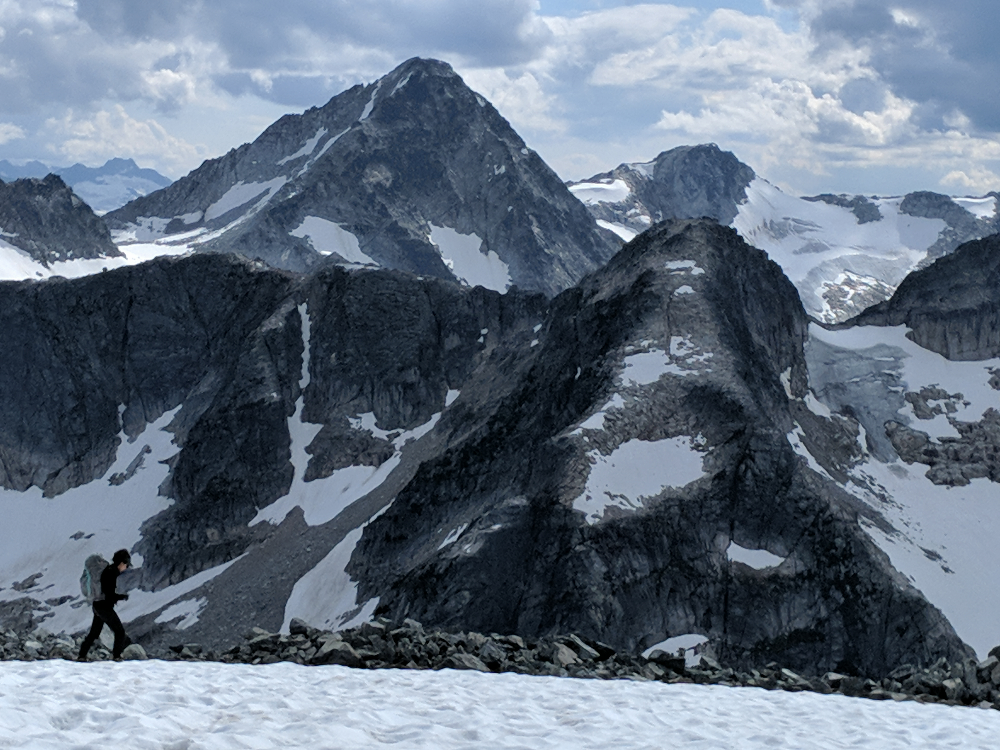

# Place Glacier

While away on visit to Zenith project on Anderson Lake to harvest apricots and connect with some friends, I was spontaneously invited to join a mountaineering expedition to Place Glacier by my new friend Erica, who I had just spent a few really fun days with in Squamish getting back into multi-pitch rock climbing after finally investing in my own trad gear.

We had a really good time, and so, in an eventual discussion with two mutual friends about a potential trip to the mountains, she was moved to put my name forward as a fourth and so I was invited to join the mission and, having the entire Summer off work and craving mountain time, I readily accepted.

One problem, I had absolutely none of my back packing gear on me! Oh well, my friends are rather well resourced in that department and since Peter, who lives at Zenith, was planning a trip to the city with his partner, he was able to loan me most of what I needed for the expedition along with some communal gear from the Zenith storage locker. All in all, I borrowed a backpack, sleeping pad, sleeping bag, gore-tex jacket, ice axe and even hiking shoes! A last minute purchase of cramp-ons rounded out the kit and off we went.

I met my oldest friend on the coast, Gabriel, North of Pemberton on the first night and we camped by a river where I would then leave my vehicle, at the traditional Place Glacier access trailhead, off of the Pemberton Portage road, about 20 min North of Pemberton. We spent a super fun day together, which in our adult lives feels like a rare treat and eventually met up with his partner Fern outside of Pemberton at a farm she works at teaching kids about the wilderness.

We eventually got word that Erica, coming off an epic herself up the Tantalus range in Squamish, was going to be late, so we got dinner and all the last minute gear preparations in order and feasted on venison when she eventually joined us around 8pm. Compliments to chef Gabriel who also made some delicious french fries and kale salad. This really impressed me because last I knew the guy pretty much lived off chocolate and maté so this was extra exciting. Clever as well, because this meant he had no food to carry for the group dinners having gone first in the rotation. The sign of an experienced mountaineer.

We rolled out to our start point that night, just a few hundred meters off the Duffey lake road (or highway 99) and camped out. It was ironically quiet, as just across the highway is Joffrey Lakes access, a trail so chronically overwhelmed with tourists that people spend more time hiking to the trailhead from their parking spots than they do on the actual trail (I jest, but it's basically true).

The next morning, we drove a little further and used our GPS to try and locate the start we had eye balled on maps. We found some blue flagging heading more or less our way and followed it until it simply stopped. This puzzled us, as trail building efforts were in ample evidence but sure enough, no more markers so into the schwack we went. We initially attempted to contour over to Cayoosh lake and ascend from there, but after sufficient time slipping about the azalea banks, we opted to just go straight up through boulder fields and gain the ridge.

From the top, it was clear this was a great choice, the walking became easy and we left all schwacking behind and cruised along the ridge to a lovely tarn where we camped for the night, with excellent views of Joffrey across the highway we had left behind.

I was next up for dinner. Having advertised simply quinoa as my offering, everyone was pretty stoked when I busted out not only crackers and raw cheddar, but fresh lime, a well seasoned quinoa bowl, beef smokies and even avocado. The backpack avocado is a speciality of Peter's, in fact, maybe his gear was having an effect on me!

The next morning, after some alpine mantras and yoga, we set out for what proved to be a huge day! We were aiming for the far side of Place Glacier, and had both a significant distance to cover with route finding.

We crested the ridge above our camp and eyed our surroundings and consulted maps. Eventually, we opted not to summit Cayoosh mountain, and instead drop into the valley and ascend the far side up and over a smaller glacier that our maps showed to yield a route to the larger Place Glacier. Our route plan:

This plan worked quite well as we found some game trails to use to gain the start of the glacier. We even moved through some lovely meadows:

Once at the toe of the snow, we put on our cramp ons, had a little crash course on glacier travel and proceeded to climb.

This was probably the highlight of the trip for me as I'd never ascended vertical snow and the gradual ascent of this cornice made for great learning without too much consequence should I end up tobogganing on my behind.

The top:

After a short break, we kept moving. Though we spent some time deliberating on the route, we eventually were persuaded to side hill across some loose fourth class terrain to come out above Place Glacier, enabling us to boot ski down to the edge of the glacier:

Crossing the glacier did not require cramp ons at this time of year, as the ice was textured and easy to walk on. On the 3km crossing of this uniquely flat and wide glacier, we sidestepped a few moulins, large holes that form in glaciers that allow water to pass through. They are actually terrifying to behold as falling into one would be the worst way to go I can imagine! Fortunately, no one fell in.

We finally made camp around 8 or 9pm and were treated to tacos by Erica. I still don't know how she managed to make tacos out there but dang they were tasty! We all promptly passed out and dreamed of goats, having seen a few travelling in the distance.

The next morning, I slept in till about 10! What bliss. Oh, and it was Erica's birthday! So the three of them opted to summit another nearby mountain while I took the opportunity to have some alone time in the mountains. I ascended a nearby peak, sang mantras and then closed my eyes for a while by a beautiful lake.

Views of Place Glacier and Cirque Peak:

It was quite blissful. As my route was mellow, I volunteered to cook the dinner Fern had packed, which ended up being dehydrated thai curry with a deer and bison mixture that was beyond tasty. I greeted the birthday party at around 8pm after their descent, having watched them for some time, while keeping an eye on the huge herd of goats that were side-hilling their way across the valley!

After a long hang by the fire, we tucked in for bed. The following morning, our party once again divided as Fern and Gabriel took an extra two days to exit back to our start point and recoup Fern's vehicle while Erika and I hiked out to my truck along Place Creek on a fairly well marked trail. The exception being this river crossing...

Again, no one fell in, and eventually we made it to some stunning falls:

And only a few more hours and we were back in Pemberton feasting at Town Square

The end!

And here is our route for reference!

