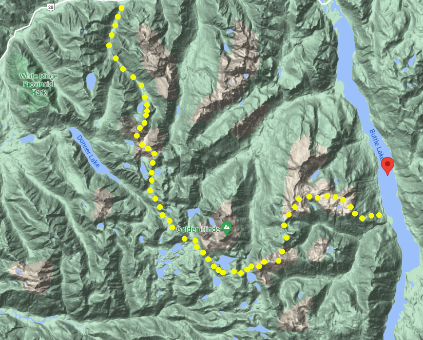

# The Marble Elk Traverse In Strathcona Park

I love planning trips. The maps, the research, the gear lists, the uniquely inspiring combination of humans and terrain, the chance to explore wild places, all of it totally inspires me. You can imagine my delight when Thomas offered that she'd be into doing a long trip in the wilderness, like a week! Exciting stuff. The longest time I'd spent in true wilderness (no cell service, rugged terrain, route-finding and bears kind of wilderness) was more like 5 days, a week seemed like a great way to stretch that comfortably, but oh where to go!

For years, I've been on and around Vancouver Island and have looked at Strathcona Park time and time again, taking special note of a route right through the heart of the park from it's Southern access point to the North portal at Elk River that runs right by the island's highest point. Ultimately, I opted to steer us via the East access because, even though it involves a water crossing of Buttle Lake, I couldn't bear to start a trip with a visit to the open pit mine that scars the earth at the trailhead to Arnica Lake at Strathcona park's south access. How a mine got into a Provincial Park is a story for another day, suffice it to say this culture has a relationship to industry that needs drastic overhauling.

With the route decided upon, I set about figuring out our food supply and gear list. We opted for a rotation of three different dehydrated meals that would be rehydrated while cooking quinoa on a butane stove, and a generous ration of snacks for lunch and breakfast to keep us going after our morning [Rasa](wearerasa.com), the herbal adaptogenic brew we have grown quite fond of that is mixed with fats, superfoods and then well shaken in a thermos for the caffeine free alpine version of bulletproof coffee. I will include a more thorough pack list at the end of this article for those interested!

## Day 1: Buttle Lake to Marble Meadows

Thomas's mother agreed to shuttle our vehicle, so we left my truck at the Elk River trailhead, where I had previously been to hike to Landslide lake, [the subject of another trip report on this blog](/tr-elkriver), and were dropped at the Augerpoint (actually named Karst Creek) day use area boat launch. Within minutes, we secured a ride across the lake to the Phillips creek campsite with a rather warm hearted Campbell River resident named Jason, who was packing out with a friend after camping there for some nights. This boded extremely well as I considered this unconventional start of hitch hiking across water to be a potential crux but, in the end, we were at the start of the trail offering prayers for our voyage by 11am, a best case scenario in my mind!

Up we went, ascending for 4 hours straight on a well designed trail that gains about 1500m over about 4-5km to Marble Meadows. We finally broke the trees around 4pm and made for Wheaton hut to get a little ahead of our itinerary. There we met and his mother Sarah and settled in for our first night of camping after a meal of deer sausage and veggies in a miso shitake gravy, over quinoa of course.

## Day 2: Marble Meadows to Crystal Mountain

The next morning saw me make our first navigational error, as we simply followed the boot path down to nearby Wheaton lake. The trail petered out, and I had to look at some maps and the GPS to realize the trail went north up the ridge and did not come down to the lake. It was a this stage that I started to become aware of a pattern, thanks to Thomas point it out, that I have of becoming distant when under stress. Because I was taking responsibility for navigation, and I can't stand to get things wrong, I withdraw when I feel myself to be failing at things. This is something of a trigger and difficult for me to spot, but that's the beauty of relationship, you can't hide! It would be some days, and further losses of the route more, before I began to break this pattern. I have found the antidote to be a carefree attitude. For one, it's perfectly normal to get off route on a 7 day hike, and second, the group is not served by a sullen way-finder, so why not lighten up about it?!

Our second day was also quite foggy, but for all that we were still delighted by the sights as Marble Meadows is a pretty spectacular area that literally hails from the bottom of the ocean. Millions of years ago, when the mountains that form the spine of Vancouver Island were formed, the sent the ocean floor way up high and the result of that is visible in this part of the mountains. I'd never seen so much Limestone up high, it was pretty spectacular.

Our second day also brought on our early challenges with regards navigating heights. We opted to sidehill the last up and down on our route to gain the call between Tibetan and Crystal mountains and this proved pretty hairy as we clung to wet heather and azalea plants in an effort not to skid down to the valley floor. This was particularly intense for Thomas who is not a fan of heights but they were able to process the fear and pull through as I was to witness them to do time and again on this rather elevated voyage! The flat an homey col (col: a low point between peaks that resembles a saddle) gained at last, we made camp and enjoyed Stroganoff for a late supper.

## Day 3: The descent to Scheldrup Lake

The next morning brought better weather, and our first designate hot chocolate day! But lo! more climbing, this time on rock. Some spooky moves and more heroics from Thomas saw us safely up Crystal mountain where we enjoyed a hot chocolate and some peaceful time connecting before once again descending into a col then down the rocky slop to the East short of Scheldrup lake through very faint trail. All in all, I'm just glad we didn't get cliffed out! The camping at the top of the lake was superb on soft ground and the pristine waters offered our first chance to enjoy a much needed rinse! Oh, and not to mention it was veggie coconut curry night :D We fell asleep to sweet bird song and rested well.

## Day 4: The Golden Eagle

We woke to fine weather and an easy to follow boot path that wound us up and above the lake and on the Golden Eagle approach trail. This mountain represents this highest point on Vancouver Island and is quite stunning to behold from any angle. Our route did not summit, but rather hugged a Westerly ridge to eventually reach the skirt of the Beagle, who sits just next to and a little bellow the Eagle. After what already felt like a long day, we finished lunch and proceeded to drop to the valley floor once more along a rather wet and sketchy scree slope / rock gully. I have to admit I wasn't a fan of this section as it was fairly hazardous, but we made it through and miraculously picked up the trail and were thus in good enough spirits to actually ascend to 1500m for the second time that day reaching the peaks across the valley where we caught a beautiful sunset and camped for the night sheltered behind some large rocks. The night sky was illuminated brilliantly and we had officially crossed the halfway threshold of our trip safely.

## Day 5: Bear lake

Another fine weather day saw us ramble along the ridge we'd ascended the day before, down and up once again, some more ridge walking and finally down easy to follow trail to a lake with no name whereby we spotted a black bear who left the water's edge and was not seen again. While this was a relatively chill day, I did have to do some bush whacking to refill our waters at one point we as opted not to collect water from various tarns we passed on the way. In hindsight, I noted that one should always collect water at every opportunity as detouring to collect water is not always possible or wise and even standing water, when boiled, can be used at camp so, while the weight can seem onerous, my new rule is to always fill up at least a couple litres at each opportunity. Lastly, before going to bed, I put my phone on airplane mode only to see that it had been on in my pocket and the battery was down to 1%... This meant we could no longer rely on the GPS (or take photos!) for navigating the last leagues of our trek... ominous!

## Day 6: Elk pass... or so we thought

The camping at bear lake was again exceptional, and afforded us the chance to take a dip, though we woke to rain! After laying in bed for an hour listening to the drops fall, we seized our chance at a break to hastily break camp, make Rasa and head out. The trail was ambiguous, however, and we soon found ourselves on a wet bushwhack along the lake that eventually had us make for a dried up creek bed to ascend up to a pool that had a very clear boot trail on its south shore that brought us right to the edge of the large lake due south of our objective, Elk Pass. It was at this point that we saw a black bear with her two cubs in the not so distant distance! They were so cute and sweet moving along the screen slopes munching on berries. We observed them for a time, announced our presence loudly and chose a route up the scree that would give them a wide berth.

While I think that side of things was a good call, I cannot speak to the fact that in my hurry to keep moving, I did not open my compass and so failed to realize that our chosen ascent was in fact taking us East instead of North!! While it looked like the easiest way through the various peaks that lay before us, our route actually took us to the wrong col entirely and my spidey senses were tingling as soon as we gained the summit and looked down to one large body of water, when I expected two smalls pools connected by the the Elk River. I braved turning on my phone to consult the GPS and sure enough, we had come up the wrong way.

A hasty lunch in the rain later, we opted to go up rather than down and began picking out our route over the mountain that lay between us and elk pass. Visibility was negligible, so we relied odd my compass to navigate and our eyes to choose the path of least resistance before us. For all that, we definitely climbed some wet moss covered granite and scrambled up some heather gullies before summiting and then descending down to what was most definitely Elk Pass this time, as evidenced by cairns and the presence of the aforementioned small bodies of water. Phew! Had we simply proceeded, we would literally have ended up Spirit knows where following some unnamed river East for who knows how long before realizing we were profoundly lost!

Instead, we picked up a cairn trail that lead us along the head waters of the Elk River and while exhaustion was starting to settle in, we managed to keep ourselves together for the many long hours of wet hiking that were to follow. We breezed, soddenly, through one old growth ringed camp site (Hemlock camp on some maps) in favour of pressing for the Elk River Gravel Bar camp site that would put us definitively back on the map with just an easy hike out to our vehicle the following day. We arrived around 7pm to a gentle reintroduction of humans, the first seen since day one of our trip!

## Day 7: Ramen bound

We woke after a night of rain and once again chose our moment carefully to pack up, though, at this point, who were we kidding, everything was soaked and there was no changing that. Fresh socks did little to mitigate the squish in our saturated boots but our spirits were up as today was the day we'd be back at the truck, sipping fine honey rum and on our way to our favourite Ramen joint in Courtenay. The morning passed uneventfully, we walked with some space between us, each integrating the adventure and content on the gradually descending forested path that required no route finding at all. I'll add that an additional delight of traveling with Thomas is catching bits of song as they sing along the trail. About an even 3 hours later on good trail, we made it back to the truck, ate a fabulous lunch on the town and got home to a cozy house to start unpacking and drying our plethora of soaked equipment, oh, and make even more food! What a ride!

Here is our approximate route for reference. There are some errors, but as a general this is how we went, if you want more details, [email me](mailto:live.alchemy@pm.me).

### Gear list

- Ultralight 2 person tent from Big Agnes
- Therma-rest ultra lite air mattresses
- MEC sleeping bag
- 1 snowpeak butane stove and large butane canister
- 1 Jetboil with small butane canister
- Compass, maps, cell phone with GPS/offline map
- Headlamp, toque, gloves, buff/bandana
- Sunglasses/hat
- Puffy jacket
- rain coat
- clothes: shorts, pants, t-shirt x2, underwear x3, socks x3, merino long sleeve, mid weight layer
- water bottles for 3 litres total
- Misc gear: knives, titanium sporks, flint, space blanket, band-aids, trekking poles, hiking boots

### Food:

###### Dinner

- dehydrated meals, 6-7 portions
- quinoa, lightly seasoned, 6 cups

##### Lunch

- duck eggs, medium boiled, x12
- buckwheat crackers x24
- beef pepperoni x8
- aged cheddar cheese, 350g
- olives, lightly dried from [real raw food](https://realrawfood.com/products/olives-herb-no-pits), 12 oz
- pesto, 150g

##### Snacks etc

- 12 [GoodTo Go Keto bars](https://ketocertified.com/product/keto-certified-goodto-go-snack-bars)
- dry fruit in abundance: mulberries, apricots, tart cherries and figs
- Arriba raw chocolate bar [link](https://www.aworganics.com/product-page/dairy-free-mylk-55)
- titanium french press + Rasa
- thermos
- butter and coconut oil mixture
- monk fruit sweetener and coconut sugar
- raw cacao and coconut milk powder blend
