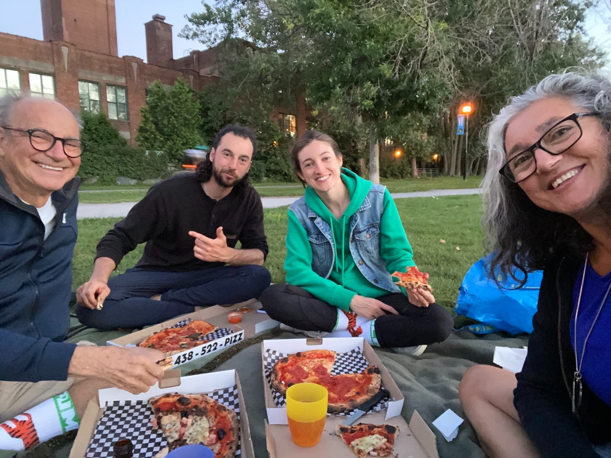
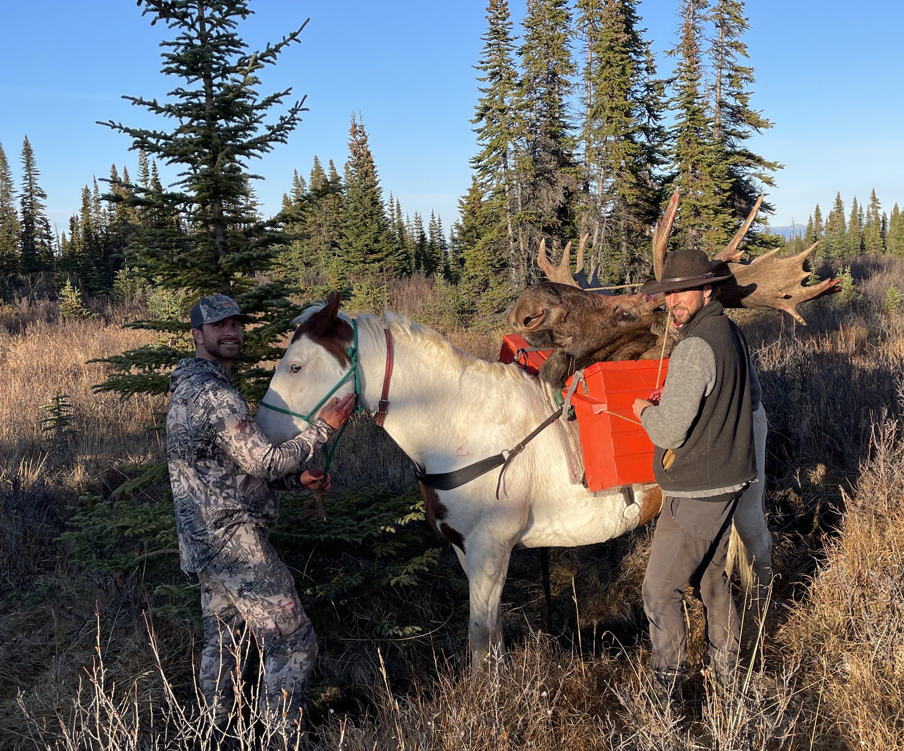

# Journey into Horsemanship 🐎

## The Premise

My journey into horsemanship began quizzically. You see, I was gainfully employed in the Spring of 2022 as a software engineer at a trendy company based in Silicon valley called Rivian. They make electric trucks. To boot, I was living the dream on an off grid land project, completing my 40 hours per week thanks to solar panels and Starlink’s newly available satellite WiFi. One problem: I was pretty miserable. As the weather improved, all my friends were outside doing cool stuff while I was ever called back to my desk to ensure I was maintaining the appearance of being busy enough. The sad reality was that I was a fairly surplus cog in a machine, with little expected of me and all the room to grow into a life I didn’t want as a desk bound corporate peon. I knew I needed to find something more in alignment and that, while I appreciated the opportunity, that 100k/year salary just wasn’t all it’s cracked up to be, especially given the weight of income tax in Canada; I’ll not digress overly on that point.

Reflecting back on my life, I realized that there lay a dream in waiting for acknowledgement. Horses had always been my sister’s thing. Me and my brother in law would drive the truck around their farm, play bass guitar, setup trains and shoot stuff, but I would ever remain curious about what was happening in the corral yonder, and curious about these beasts who produced all the poop we had to clean up.

## Forays into horsemanship and horse packing

Over 20 years later, I decided to undertake this learning journey, hired a private lesson for my first time riding as an adult, then moved up progressively longer trail rides that culminated in 4 hours of mountainous trail riding in Pemberton.

|                                                     |                                                       |
| :-------------------------------------------------: | :---------------------------------------------------: |
|  |  |
|                                                     |                                                       |

I had a goal. Having heard of folks going up to work in the Yukon and such places as hunting guides on horseback, I inquired and was directed to Stan Walchuk’s school for horse packing in McBride, in the Rocky Mountain trench. I signed up eagerly, finding the price quite reasonable and the timing of mid June just right. I gave my two weeks notice in May and also signed up for a vision quest that would take place at the start of July, but that story is still curing so stay tuned.

As it turns out, Stan had just sold his business having agreed to stay on and teach that year. Unfortunately, the new owners were wanting for liability insurance 🙄 and opted to cancel the course last minute. Only problem: I had arrived on site a week early and was determined. A couple from Ontario had been driving for a few days and missed the memo, so there we were along with Stan’s two Swiss workaways. Stan, being the classy gentleman that he is, offered to teach us the course privately and rent us the horses so we could get a taste for horse packing, what a stand up human!

I really enjoyed the course and got a lot out of it. I also had a great time with Alyssa and Dan, as well as Donnie and Ginger some of our ancient and venerable steads.

Here are some photos from our time together:

|                                                |                                                   |
| :--------------------------------------------: | :-----------------------------------------------: |
|  |  |
|                                                |                                                   |

With that period of learning complete, I was ready to head into the vision quest. 10 days later, I tumbled down the Sea to Sky highway landing in Squamish. Admittedly, the world seemed a strange place. After 4 days in prayer and ceremony, without food or water and sleeping under the sky, the delights and trinkets of civilization were garishly irresistible and, while I still enjoyed climbing, I was dogged by a feeling of having gone backwards in time, so I began to write to outfitters to see if anyone would have me. As it turns out, some seemed interested. My first bite lead me to the realization that I was ready to hop on a plane to Whitehorse at a moment’s notice, and when the second opportunity started knocking in earnest, I decided to go for it, in spite of an offer to house sit in Squamish, a rare and choice luxury. I stopped in at the Squamish men’s circle, was duly blessed by my brothers there and started the trip North that night, spying a wolf on the side of the highway on my way out, I regarded this as a stellar omen portending favourably on my time in the wilds of Northern BC.

  
  Spatsizi Wilderness Area

## Now, a wrangler

I had signed on with Spatsizi River Outfitters, formerly the Collingwood Brothers outfit, lately purchased by a rancher from Quesnel, with the understanding that I would be able to complete a trip to Montreal to see my Father on his 75th birthday in mid August, and that I could spend most of July attending the horsemanship workshops being held at base camp by a famous horse trainer named Glen Stewart. I arrived at Reg Collingwood’s ranch in Smithers on time, was regarded with uncertainty (my main of unruly curls surely playing its part in this perception) and was tasked with oiling saddles until my ride showed up. Eventually, that is to say at around 8pm the following day, I was collected and immediately tasked with driving a huge truck pulling a horse trailer on an 8 hour drive. At 2am, my companion Jamie and I pulled into a rest area to get some sleep. I crawled into the back seat where I lay down and eventually caught a few hours rest. In the driver seat, I don’t believe Jamie was as fortunate. At daybreak we forged on to the town of Iskut, some 4 hours up the Cassiar highway and reported to the staging area known as Mountain Shadow, an RV park also owned by the outfit. We offloaded the horses at a large corral and were prepared Kraft dinner for lunch. I made myself some eggs instead, as yet under the delusion that I would maintain my dietary standards. Jamie, who is 18, now the most experienced person on staff on account of having done this the season prior, and I finally got rolling to cut the trail to the hunting unit’s first base camp at around 5pm. Known as Bug lake internally and as “Eaglenest Camp” in the marketing materials, we were told it was a two day ride on easy trail.

  
  Park map

## Cutting the Trail

The ride got off to a rocky start. Our packhorse rolled his pack as soon as we were out the gate, and the fellow who drove us came trotting up behind brandishing my axe as it had fallen off my horse instantly. We repacked the horse, I secured the axe and we departed in earnest only to have the chainsaw fail to start at the second tree we found laying across the trail. Having dealt with a number of chainsaw failures that Winter, I felt this was at least predictable and Jamie and I were able to diagnose a flooded carb and patiently allowed it to drain out while hacking at tree uselessly with my axe. We eventually got the saw running again and were off, but no sooner had we completed perhaps 15% of the trail in did the saw get caught under some trees and was utterly ruined, the bar bent to a full 90 degrees away from the handle. Oh well, good thing I had that axe, a last minute purchase in Smithers.

We arrived at the first campsite, Cache Camp, around 2am, and I was beginning to discern a theme to this line of work. The following morning, we noticed that Jamie no longer had his InReach device, but my intuition suggested a quick trot back down the trail and I found it after about 10 minutes at a light jog! We rode on, the pack horse rolling once more and gear tumbling off our saddles again. When we finally got sorted out and settled on our routine for tying the diamond (a hitch that is essential for keeping a packhorse secured), we made decent time, even without the help of the gasoline powered chainsaw. This is where the trail gets rough. Numerous hours of bogland lay before us and so we trudged on and on until we finally made the second camp at Cullivan Creek, managing to unstuck a horse hoof without injury. With a couple hours of daylight left, we opted to ride on and press for Bug, arriving under the auspices of twilight. Exhausted, we noted that a grizzly bear had utterly destroyed the cook house but we opted to leave that as it lay till the morrow.

On the morrow, a float plane landed on the dock and insisted on returning Jamie to Mountain Shadow to lead a group of staff and clients, including Glen Stewart, back down the freshly cut trail, this time in a single day. The plane also deposited the camp cook, Gwen, whose task it would be to clean the cookhouse. I assisted by fixing the water line and doing what little I could given my exhausted and sore condition, hardly daring to imagine what Jamie was going through. Gwen was able to get Shepherd’s Pie ready and had it warm for the groups arrival at, you guessed it, 2 in the morning. Needless to say, they were a little shell shocked by what had just happened and I was to hear a detailed account over the next few days of how chaotic it had been to ride that endless trail in with 43 horses, including 7 colts who all got loose and failed to make it to base camp, in a single afternoon.

  
  The accommodations at Bug Lake

## Chasing the Colts

While we resisted for a few days and attempted to learn what we could from Glen, we were ultimately defeated in our attempts to stay the owners hand and were duly dispatched to track down the missing horses. This time, we had the benefit of riding with Leon, an experienced horseman of 24 years. Back down the trail we went, and back into the bog we went as the case may be. Arriving at Jamie and I’s first camp site after 10 hours of riding, we reported, via InReach, that we had seen fresh sign of the horses but avowed to each other that we were going no further. The owner, whose name is Mike, or Big Taco colloquially (it’s a long story), insisted we were hot on their trail and that we were to continue riding down the trail that very evening. We grumbled but ultimately rode on the next morning. Miraculously, we found two horses in the forest and they duly fell in behind us all the way to “The Grade”, an abandoned rail grade started by the NDP many years ago that serves as the trailhead for the McEwan trail leading into the Spatsizi Wilderness. There we met Taco, who immediately ordered us to continue searching for the rest of the horses while he drove around in his truck. He was beginning to make an impression on me, at least he’d thought to bring some food. We found no more horses at the grade, and eventually were permitted to rest and eat. Jamie and I spent the night in the tent while Mike took Leon to mountain shadow to look at horse shoes. They returned the next day and the 3 of us began the journey back with the two colts in tow at noon. Lo and behold, we ride into a small clearing wherein are the remaining 5 colts! We approach cautiously and manage to catch another colt and add them to our string. We rode on expecting the others to follow, but soon enough it became clear the remaining 4 did not take the hint. At the first camp, we corralled the horses while Jamie and Leon rode back to see what they could while I made fire and pitched our tent. They returned an hour or two later without any colts, having seen their tracks heading back to the grade, and so we settled in to a night of Stagg Chili with quinoa and fart jokes by the campfire, true trail staples.

We rode all the next day back to Bug and felt we had at least accomplished something. Within a day or two, we received word that the remaining colts had gone to The Grade and been picked up by Mike and brought back to Quesnel to his ranch. We spent a few days with Glen and his group and soon enough August rolled around and with it the infamous stone sheep hunts.

## Hunting for Stone sheep

  
  <small>Tex, my trusty steed for this trip, known for munching grass constantly and being 3 times faster on the way home than the way out, a consumate beta horse, even minded, gentle and reliable.</small>

The next 2 weeks of my life, including my 33rd birthday, were spent at Ram Creek, a full day's ride out from Bug lake, hunting stone sheep. This essentially involved waking up at 5am each morning, strapping on wet boots, listening for bells while hiking to find the horses, bringing them in, saddling them, scarfing some breakfast then riding up to the treeline. There we would tie the horses and proceed to hunt for stone sheep on foot, largely by way of binoculars and spotting scopes. Ultimately, one of our two hunters was successful, but at that time I found myself alone at ram creek camp taking care of the horses. Nonetheless, I was able to enjoy many adventures and was pleased to find myself connecting with my fellow wranglers Leon and Brittany as well as the guides Guy, Becky and Barry. The stories from this trip are many; I would be amiss not to mention the sheer delight and beauty of riding horses through the sub alpine on a daily basis. I also must tell one particularly notable tale that occurred on a rest day. We were weathered in, and so around 4pm I decided I'd go get some meat to start cooking dinner. We kept our meat in a pack box in the creek to keep it cold. Unfortunately, the pack box got full of water, so I took it upon myself to try emptying it, while wearing crocs, on uneven wet ground... You can imagine how that went! Into the raging current I tumbled and, to my horror, not only was I being swept away, but so were packs of our precious meat supply! I began scooping what I could lay hands to out of the creek and hucking them on to the bank while sorting myself out and clawing my way to my feet. Eventually, I got out of the water and took a tally, I had lost perhaps half of the meat. It wasn't till I got back to camp and warmed myself up and explained what had happened, head held low, that I realized that my cell phone was no where to be found. Dismally, I recalled that it had been in my pocket, the zipper unfastened, and now surely was making its long way to the ocean! I was pretty down for the rest of that day. Not only because I had exacerbated an already strained food situation (we had failed to pack two pack boxes full of food, and a party was en route back to Bug Lake to retrieve them at the time this happened), but I had lost all the photos I had taken up to this point, not to mention a precious store of dream log recordings from the previous 6 months, an especially rich time for me in the dreaming world. Oh well! Life goes on, I eventually regained my sprits and, fortunately, we never did want for meat in spite of the loss. In the end, I would much enjoy regaling the group at Bug with this humorous tale, inserting due suspense and animation.

## Montreal and back again

Upon our return to Bug, I was quickly whisked away by float plane back to Smithers, where I boarded a flight first to Vancouver, where I met a pair of dear friends, and then on to Montreal for a 10 day visit with my family. I had not been to Montreal in 5 years, but in short, I had a wonderful time visiting friends and family and celebrating my father's 75th birthday. Also got a few games of Soccer in with the boys ⚽

  
  Fam jam, enjoying some pizza on the canal, so much fun!

At the end of this visit lay a cross roads, but I knew in my heart that I would go back to the Spatsizi to complete the season, perhaps to everyone’s surprise. But I would do so better prepared. I discarded my spent boots and equipped myself with new Muck boots (Wetlanders! nb: a full gear list for future newbie wranglers will follow this article), a new pair of Meindl boots (German made calf high hunting boots), a set of rain gear suitable for riding and a new watch that actually worked properly. Additionally, I spent about $500 and 12 hours on food prep and was able to completely bypass the low quality fare on offer whenever I chose to being armed with quinoa, dehydrated curried veg mix, granola and a huge pile of trail snacks like dried mango, figs and apricots. Shout outs to my folks for helping me track down a dehydrator and supporting me in re-outfitting myself while in Montreal. I also picked up a new phone on Kijiji and got it all set up and loaded with audiobooks.

  
  The Caravan, lifeblood of the outfit

## Return to the Spatsizi

Returning just the way I had come, I found myself back at Bug lake in short order and ended up being tasked with caring for the horses left behind at Bug, some 18 head. This was a fairly solitary and uneventful time wherein I found an excellent book, Ursula K Leguin’s The Dispossessed. It spoke deeply to me, and I’m so grateful it was there to help fill the days, along with Cormac McCarthy’s Blood Meridian Audiobook. After a particularly dreadful morning of wrangling (I got in around noon, soaked), I was told that I was to pack my bags and get on a plane that afternoon, I was going to Las Lui, a luxurious fishing lodge that had a dozen horses and would be receiving some hunters. I was elated by this turn of events. Las Lui had a chef, WiFi and was generally considered the best place to be in the whole guiding territory, and it did not disappoint. It was there I met Kirk, who would teach me a great deal about the craft of being a hunting guide. I’m deeply grateful for his patience and willingness to pass on his knowledge, we connected on a number of levels and worked two and a half hunts together, had many adventures and worked well as a team. It was also during this time that I connected with Logan, a tall strong and fast Percheron Quarterhorse cross who was an able leader. It was Logan who bore me for this entire month and I grew quite fond of the fellow. It was during this period that I got to be on site and present for the death of an animal, a beautiful woodland Caribou from the Spatsizi Plateau. Prayers up, he died on impact and I was able to bring home the liver and prepare it for everyone, it was savoured by all.

  
  Riding along Ella creek

  
  Bruce’s Caribou, shot at 775 yards in an 11mph crosswind

  
  We rose to snow for the trail out. Logan ❤️

  
  Italian father son pair, Kirk and I’s first clients

  
  Spotting scope

  
  Kirk (top) and Bruce looking for goat

  
  Learning to shoe horses with Leon and Logan

  
  The luxury lakeside lodge of Las Lui

## The Big Moose

Eventually, Bjorn, a newly minted guide showed up at Las Lui and we were told we’d work together on the last hunt of the season, a moose hunt back at Bug Lake. I can distinctly recall Bjorn saying to me: “I want to get a BIG moose” in his heavy Norwegian accent and I fully believed him when he said it. I’ll admit, I wasn’t immediately taken by Bjorn. He is pretty rough around the edges, smokes and swears constantly. But over our two weeks together, I got to think of him as a friend, appreciating his work ethic and competence as a moose hunter. He told me he has guided something like 60 moose hunts back in Norway, where moose is a staple of people’s diet. He is also pretty hilarious if you’re willing to be entirely politically incorrect!

Our clients were a couple from Utah, and this was an interesting dynamic to coexist with. Additionally, the hunt got off to a rather disorganized start. Bjorn was flown in after the hunters had waited in camp a full day, and we didn’t really know where we were going, though we had a GPS point. Setting out with 7 horses, we had the bare minimum, but at least the client horses were well suited to the riders and I was riding Thunder, a fast and smooth trotter, excellent leader and even minded buckskin horse.

  
  Babe, Tex, Thunder, Big Ben, Smudge, Ghost and Brownie 💥 gang gang

It took us a full two days of being mostly lost to find the camp at plateau lake, what should have been a 7 hour ride. Sometime on the morning of the second day, the clients clued in that we had never been there! To me, this was obvious, but it rattled them a little and certainly contributed to the overall feeling of disorganization that permeated the outfit. For all that, the hunt was a wild success. The first morning out hunting, I was feeding horses at spike camp when I heard gun shots. I could hardly believe it. I set up 2 horses for packing and waited. The clients returned while Bjorn was quartering and we set out again with the pack horses while they regaled me with the tale of the moose hunt. Turns out Bjorn knew his business and impersonated a moose so convincingly that he was able to lead them to the great patriarch of those woods, a moose so huge and stately that Taco himself flew into Bug Lake to behold the massive and uniquely shaped antlers. This was my first time dealing with such a huge set of antlers, no mean feat when it has to be securely and safely attached to an already over burdened horse, as we were packing not only our gear, but probably 500 lbs of moose meat. We were able to leave a lot of gear at the camp and made it work and sharing the heart over the campfire that night was very special.

  
  Ghost promptly tossed this pack, but fortunately Tex was up for it 🙏🏻

  
  We only had to retie the head once, go Big Ben!

## The Trail Out

Upon our return, we began to make ready for our departure from the area on horseback, with most of the herd. Leon and I were reinforced by a pair of cowboys from Alberta and a horticulturist from Australia. We had over 30 horses to lead out, including those 3 willful colts who were a little better trained now and the plan was to do the trip over two days. We made strings of who we could and set out with me at the helm on Thunder with Leon bringing up the rear. The cowboys egged on and wrangled up the herd as needed. Before we’d made it two hours, just about all of our carefully selected strings had come apart and we were proceeding pêle mêle down the trail, loose horses running around all over, all generally headed in the right direction. The horses, fortunately, were all very keen to head to their Winter pasture and so we didn’t really have to worry about them. We took whatever opportunity we could to tie flopping lead ropes and mostly just held on and tried to keep the train in some semblance of order with a rider at the front to ensure it didn’t turn into a full on blitzkrieg. All things considered, we may as well have had everyone loose and just ran the trail out. At this time of year, the bog was much drier and easier to travel and overnighting at Cache camp was pretty useless. But, we made it, in spite of our pack horse blowing up within 20 minutes no day two, cementing me near the back of the pack as I redeemed my initial packing effort with a fresh diamond. I spent at least an hour or two worried about some pack boxes that I lost track of, but we found them on the trail eventually and so my fancy German boots and spotting scope were not lost after all. Shout outs to Adrian for catching a horse with a pack saddle, turning him around, and enabling us to pack those boxes out. And shout out to Joe the injured horse! In spite of a season of rest, he was still looking very swollen and in need of vet care, but he trotted his way out with the rest admirably. This would mark the last time I would gallop with a gang of horses and for me this represents one of the peak experiences of my time out on the Spatsizi, there’s just nothing like the feeling of riding a wave of will and strength, such surrender. It’s kind of like surfing, with perhaps a higher consequence fall! To that end, I only fell from the saddle twice all season, and never injured myself, so I’m very grateful for that. Bizarrely, the worst thing that happened, besides a very strained left ankle from hours in the stirrups, was a mysterious and enormous zit that appeared on my jaw at the end of the trip. It was painful and gnarly but mercifully sorted itself out with time. Weird! I blame that Mars bar.

I got back to Mountain Shadow and was dispatched to de-shoe horses at 9am the following morning. We spent the day doing that, a group of 4 removing all shoes from a total of 30 horses. Duly exhausted, we made plans to begone at 5am the following morning least we get roped into further labours and so I found myself back at my truck on the ranch in Smithers on Thanksgiving day. I would miss the feast that took place the evening prior at Anderson Lake, and so I made my way leisurely down highway 97, stopping in at Leon’s farm near Quesnel and enjoying both delicious home cooked food and the hospitable and kind company of his family.

Having made my way slowly back to the Comox Valley where I’d agreed to housesit for a friend, I find myself with the time and space to reflect and process this spectacular journey. Oftentimes, I find myself feeling as though I’d just spent the Summer in the military. The contrast between the very intentional and warm life of the communities I frequent on the coast and the results driven “hurry up and wait” attitude of the outfit could not be starker. It was meaningful for me to connect with my co-workers where possible, but ultimately my journey was largely about my responsibility towards, and connections with, the horses. I’m very grateful to those powerful and sensitive beings and trust I can continue to apprentice myself to their ways and care.

I thank you for reading!

  

Herein follows a list of supplies I recommend for anyone looking to do this work in the future for reference:

- Gum Boots, insulated, Muck brand
- Gore-tex lined leather boots, Meindly recommened, higher than ankle also ideal
- Helly Hansen Helox rain gear, coat and pants
- Gaiters
- Crocs/sandals
- Thermarest (+repair kit) or bed roll
- Warm sleeping, -9 minimum
- Hunting backpack ~50L or more
- Book, journal, pen
- Trail Axe and saddle fastener
- Folding saw, pruning saw, saddle fastener
- Lighters
- Floss, toothbrush, toothpaste
- Soap
- Towel
- Water bottle, at least 2L
- Leather work gloves
- Leather waterproofing treatment, good for gloves and boots
- Warm mits for riding
- Knives + sharpening stone
- Brim hat
- Puffy jacket
- Bandana + buff
- Synthetic layers as well as wool
- Headlamp + spare set of batteries
- 1st aid kit
- Space blanket
- Storm proof matches/fire starter
- Day pack
- Binoculars, spotting scope optional imo
- 30 gauge lever action rifle + saddle scabbard
- Titanium spork

Additionally, if you like to eat well or are particular, bring as much food as you! I also like to drink tea so a thermos goes a long way.
Beyond that, I also packed my own butane and cook stove so that I was independant, this was nice to bring along on cold days too for a warm drink on the trail.
Lastly, I always had my own ultralight tent or bivy and I found that to be an asset on occasion, but the outfit had numerous tents so I didn't need to have it.
An ultralight tarp would not be amiss for emergency shelter

And for real, lastly, this is a loose transcription of a poster in the wrangler bunk house at bug lake, I found it to be pretty spot on:

## WANTED: Wrangler at Bug Lake

### NO EXPERIENCE REQUIRED

- Must be able to survice sub zero temperatures
- Must enjoy working 23 hours per day
- Must thrive on little to no sleep and have excellent night vision
- Capable of surviving on little food of negligible nutrition
- Excellent horse catching skills an asset
- Inability to complain is mandatory
- Maintain an agreeable disposition at all times
- Does dishes without being asked every night
- Be ready to change plans at a moments notice
- Little concern for personal welfare desired
- Rappeling and climbing skills are very welcome
