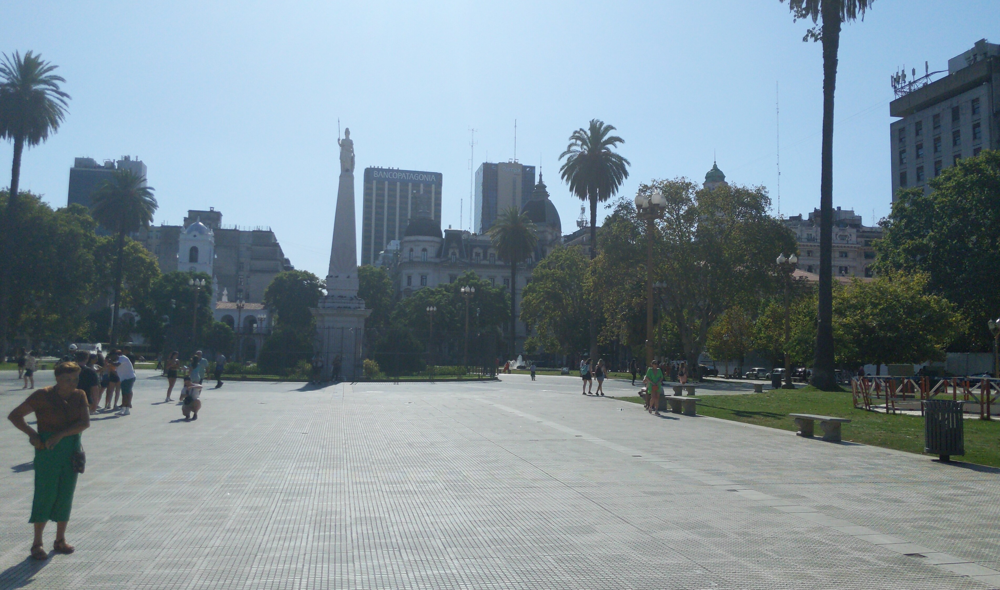
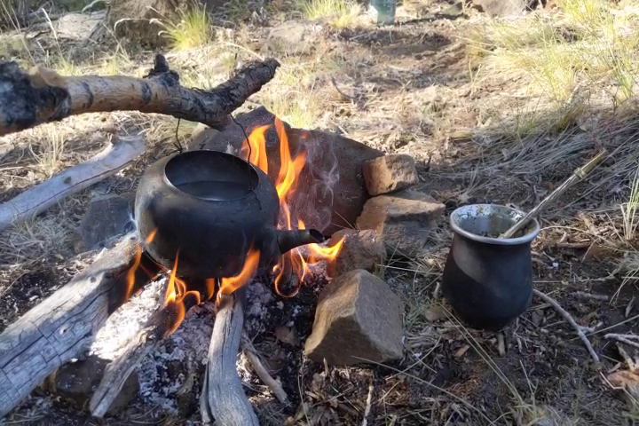

# Argentina Trip Report

## Pre-amble

Many years ago, at the tender age of nineteen, I left Montreal for Vancouver with the idea that I’d eventually make it to South America, perhaps by bike. I made it as far as LA on two wheels, a feat in itself, and, for the last decade, felt like I’d make the trip down some day, some day. Emerging from three years of travel restrictions, I realized that it still very much mattered to me that I visit South America. With the prospect of another rainy coastal Winter looming, I pounced.

After a wonderful month spent on a sleepy gulf island, guiding my friends through the process of deer hunting over the course of two weeks while house sitting, I set my sights on a Christmas visit to Montreal and quickly booked a follow up flight to Buenos Aires for the new year of 2023 with little idea of what I was getting into. I started learning Spanish on DuoLingo though, so there was that, and it so happened that a friend of a friend at deer camp has relatives in Argentina, and that was enough to hang my trip’s hat on.

## Buenos Aires

_Hot hot hot_

Landing in Buenos Aires after the all night plane ride was surreal, and very very hot. I’d touched down as Summer was properly ramping up, and I was definitely wearing too many wool layers. I exited the airport and made for the shuttle bus. I knew this was my preferred option for leaving EZE because I had pored over <a href="https://solsalute.com/blog/guide-buenos-aires/" target="_blank">this excellent blog about visiting Buenos Aires</a>, wherein the author faithfully details the multitude ways you can attain the city centre from the airport, among many other key insights. If you are reading this looking for trip inspo, you can rely on everything written in that blog, I found it to be totally accurate on all accounts, especially with regards accessing funds in Argentina, something I’d been warned was tricky at best.

  

In brief, Argentina’s currency is so volatile that Argentinians will pay double the official exchange rate for American dollars to safeguard their cash assets, effectively creating two exchange rates. For the totality of my trip, I managed to only deal in this “blue dollar rate”, which really made my Canadian dollars go the distance.

For instance, this huge stack of 500 Peso notes probably cost me about $50CAD, each dollar got me roughly 300 Pesos and I found everything food-wise to cost about 1/3 of what it costs in Canada. Eg: fancy coffee and a croissant: ~600 pesos

I had decided to spend 10 days in Buenos Aires before flying across the country to Northern Patagonia to meet up with Nikki, my friend Moyra’s cousin. My rhythm is pretty relaxed, so I like to take my time and get to know a place rather than pack in a bunch of tourist stops. Even so, the 10 days flew right on by. My pattern settled on sleeping in till 11am, when house keeping would come clean the hostel rooms. Then I’d go to the café and order a Cortado with two media lunes (honey glazed mini croissants, “half-moons”), a staple of Argentine breakfast which they take quite late compared to North America. At the café, I’d read and journal before taking a walk, perhaps taking in graffiti or architecture, both of which are on display in spades in this old world cosmopolis, perhaps stopping at one of the outdoor fitness areas to do a work out before returning to the hostel to shower.

_San Telmo, the heart of Tango in Buenos Aires_

Then I would siesta and, upon waking and not having acclimated to the Argentine tradition of eating dinner after 10pm, have supper at any of the many amazing dining options afforded by Buenos Aires including the famed Chori Pan restaurant I’d seen in an episode of Someone Feed Phil with my family the night before my departure.

_Recoleta cemetery_

_Famous book store in an old theater_

  

    
    A typical late lunch, ~3CAD
  

  

    
    classic morning fare
  

_Ubiquitous Lionel Messi adoration_

From there, it was time to chose a Milonga for the evening, the setting for Argentina’s national passion: Tango. A Milonga is a kind of social dance with certain protocols and predictable patterns. Fortunately, for newbies like me, they almost always involve a class that starts around 8pm and things are heating up by about 10 or 11pm. The dance floor will be populated with a rotating cast of couples making their way along the perimeter of the floor in a circular motion at different paces, creating a kind of harmonic chaos that was and remains intimidating for the novice tango dancer.

In fact, the first few nights, I only watched and it’s something of a miracle that I made it through my first milonga at all as I was way out of my depth having accidentally ended up at an advanced class dancing an obscure form of tango that nobody really knows about. Trial by fire. By the end of my trip I had my bearings and knew how to find milongas (hint, it’s <a href="https://www.hoy-milonga.com/buenos-aires/es" target="_blank">hoy-milonga.org</a>) that were beginner friendly and more likely to have other foreigners with whom I might be able to speak some English or, as was often the case, French. I was hooked and the two weeks went by too fast but, as it happens, though Buenos Aires is the epicentre of Tango globally, it was not to be my last waltz.

  

    
    Teacher demo at Viruta tango club
  

  

    
    Outdoor tango buskers in San Telmo square
  

## Bariloche

Entering a whole new rhythm and landscape, I was picked up at the airport by Nikki with her one year old son Timmy. I immediately felt very at home with Nikki, she is a very bright and kind woman and we got along quite well as her English is excellent.

_By the lake with Nikki and Timmy!_

She brought me to her family estancia and actually gave me her cozy cabin to use while she opted to spend the week at her partner’s house. Her brother, sister and parents were all around, equally lovely and hospitable. I really enjoyed meeting them and hanging out wither every member of the family and I feel like I could have easily stayed for a month. Only one day was needed to check out the touristy settlement of Bariloche, the rest I spent on the ranch helping with a fence and generally enjoying the tranquility as well as becoming acquainted with the plants and animals of Northern Patagonia. Nikki also brought me to the Argentine cowboy store where I got outfitted in some local duds!

_Gaucho chapeau and a new bandana from Nikki 💚_

I kept working on my Spanish and learned some more from Nikki’s family, and had my first lesson in Maté preparation from Marco, her brother.

Still very much a Spanish novice, I firmed up plans and made ready to head to a ranch I found via HelpX called Estancia Ranquilco. To my eyes, it was the promised land with horses, free ranging cows, goats and sheep, and trusty pack mules to guide guests through a vast wilderness dotted with old world stonemasonry, fine dining and the real purpose for my journey: gauchos, the argentine cowboys I’d been seeking to impart some of their horse lore upon me. As we’ll see, Dad was right again: “if it sounds too good to be true, it probably is”, and this situation sounded positively ideal.

## Ranquilco

### The journey to Ranquilco

Ashley, the estancia owner, gave me a rendez-vous at the provincial capital of Neuquen’s airport, so I took an 8 hour bus from Bariloche, spent the night in town and hopped in a diesel hilux the next morning with two British clients bound for Ranquilco. Funny enough, I was the best Spanish speaker of the three of us so it fell upon me to do what rudimentary translation was necessary. We drove some five hours, left the pavement and carried on another two on what was barely a road until we reached a gaucho outpost called Butta Majin. From there, I met fellow volunteer McCaleigh who had brought me a horse and, after paying the driver a hefty 133USD for the trip, off the two of us went, the clients now in the care of other volunteers.

*The ride in with McCaleigh, she’s from Pemberton of *all places!!

Three hours later over dry and rambling country and then down into a lush valley, we rode by the picturesque stonework of the Ranquilco “downtown”, guest houses, tack sheds, an office, pastures and volunteer quarters.

_Main guest house at Ranquilco_

_Office, with satellite WiFi, incredibly_

_Activity at Ranquilco’s downtown with a backdrop of sausé trees_

_Ranquilco Valley_

_Stonework at Ranquilco roadhouse_

But this was not our destination as we rode on along the stream feeding into the mighty Trocoman to eventually reach a rather dilapidated shack… our place!

_Home sweet shack!_

This is when the veil started to fall and began to realize that I’d misplaced my expectations somewhere in the stratosphere. We carried on as the sun set to Ashley and Jen’s house, 20 minutes uphill to drop off the horses. They invited me and McCaleigh in for a glass of boxed wine, we talked for an hour and back to the stream house we went on foot. I knew it not then, but this would mark the only time I had a conversation with my hosts that wasn’t in passing, and the only time they offered me anything besides the provided communal foodstuffs. Fabian, the other volunteer in residence, a frenchman who was to become my closest friend, co-chef and confidante while on the ranch, had dinner ready and by this time I was as grateful as could be for some grub and slumber.

_My main man Fabian, d’Angers, out here building trail_

### A month at Ranquilco

My time at Ranquilco was a mixed bag. My expectations were misaligned with what I discovered, and it was difficult not to feel resentful towards Ashley who had painted a certain picture over email that, while not strictly false, certainly oversold the whole thing and glossed over the challenges. For instance, the volunteer accommodation was in effect repurposed animal housing, impossible to clean and infested with wasps and scorpions, it’s unfair to typify this as “rustic”, I ended up setting up an outdoor camp for myself and sleeping under the stars for the majority of my month stay and was happier for it. Our food supply was rationed, and consisted almost entirely of carbs, though we were gifted some eggs, cheese and garden veg every other week. It was also unclear that we were volunteering for Ashley and his partner Jen who lead separate lives from the main guesthouse operation and volunteer program that I’d be so keen to partake of based on the website I was sent by Ashley (ranquilco.com for those curious).

On the day to day, our volunteer workforce would walk uphill to Ashley and Jen’s rather luxurious residence and work hard from 8am-330pm with a lunch break and the occasional pause for Yerba maté, the Argentine beverage of choice that I came to love. Then we’d return home, make ourselves dinner and extra for the next day’s lunch, sleep and repeat. Because everything was cooked via wood fire, this also meant making about three fires per day, and sawing wood for said fires… with a dull hand saw (until I brought the chainsaw home one day 😎).

Still, I got pretty good at making pizza in a skillet! And, we even had fresh basil!

_Sourdough crust, cheese, bit of goat, some herbs, what more do you need?!_

_Daily ritual_

On the topic of Maté, we’d often share this ritual with José, Jessica and Luz Azul their one year old daughter. José was our day to day work manager, and I’m very grateful to him and his family for being kind, considerate and fun to work with. I felt he cared for the volunteer program at Ranquilco in a long term capacity in a way that our hosts did not, and he’d regulary host us at his home for maté or a meal. With him we could speak Spanish and learn more about Argentine culture. We got to have Asados (traditional Argentine barbeques) and cook home made gluten free Milanesa (think Schnitzel), made with goat of course, the only meat I consumed for virtually the entire month of February (at first that sounded good until I realized we’d be getting only the most aged goats… you’ve surely heard the saying “tough old goat”). My work trade tasks consisted entirely of trail building, which meant operating and maintaining a Stihl MS 371, a pretty heavy duty tool, along with secateurs and a wheel barrow. While it was satisfying to see the trails take shape, I’ll admit this routine got pretty tedious after a while and soon I thought of little else but getting the heck out of dodge feeling disillusioned and lamenting the lack of horse focused work.

From this period, my favourite experiences were overnight hikes, one solo and another with two hearty pals Fabian and Jordan, from Ontario, who arrived some weeks after me. We did also have a great overnight horse trip to a beautiful river confluence, I got to watch an old gaucho butcher a young goat with insane skill and hanging out at José’s place, at the river, or at the volunteer house as a group was always enjoyable and I picked up some awesome French slang from the other volunteers, who were either French or Canadian exclusively! Of course, the scenery was always breathtaking and the land home to many beautiful animals as well as a number of gauchos dwelling in puestos, as we were to discover on our overnight hikes into that vast wilderness. At least, to us, it appeared this way, but to the gauchos who pastured their animals and made their lives there, it was simply a neighbourhood.

_Riding out to the confluencia_

_My guy colonel_

_Asado at the confluencia_

_Jessica bathing at the confluencia_

_The hike to the office wasn’t bad either!_

_Solo hike photo op_

_Being silly in the wood fired hot tub_

_Sunrise views walking to work_

_Cool natural building project: a woven fence_

_Early morning ride to collect our weekly goat_

_Spotted an armadillo!_

That said, when the chance presented itself, I seized on the opportunity to high tail it and try my luck elsewhere, even if it meant going the long way.

### The flight from Ranquilco

Opportunities to leave Ranquilco were few and far between as the combined journey of 3 hours on a horse and 2 hours by truck to the nearest small town were strictly as needed, so I opted to take another route and employ the old horse trail North to the tiny town of El Cholar. I spoke to a fellow who had done the journey on horseback recently enough, got some details from Ashley, who’d owned the ranch for some 40 years and knew all the ins and outs, and made arrangements to ride the first half of the journey with McCaleigh, who would drop me and take the horses home while I continued on foot. The day finally came, we started early and rode to the crossing of the mighty Trocomán river.

_We took a quick dip, rode on another half hour and said our goodbyes, time for me to make my own way!_

_Above the Trocoman_

_Near the Trocoman_

The first hour went by peaceably, but as time wore on, so too did the heat and I soon found myself with the river far below and the sun bearing down relentlessly as I left any sign of trees at the water’s edge. For hours I trudged, from horse trail to single track to dirt road and on, at long last, to gravel. Eventually, I heard the sound of an engine in the distance, and later again, then again, but always they drove in the other direction, towards the river. Eventually, I stopped in the shade of some stones and took stock. My backpack was full, and I was wearing long everything to cover my skin from the sun. Everything was itchy and sweaty and uncomfortable; 10 hours into my journey, I still had 5 km left to walk.

_Blue steel, hot hot heat variant_

I steeled myself and set out once more, and was immediately rewarded by the sound of a truck, at last coming from behind. The older couple who stopped were clearly puzzled by me, but they agreed to take me to El Cholar, and it turns out they knew Johanes, the goat herder I mentioned earlier. Finally, in town, I got a cold drink and some snacks and nearly wept with relief on a park bench. Fortified, I decided to try hitch hiking on to the larger town of Chos Malal where I planned to stay a few nights to recover, but no cars came that night. Returning to El Cholar, I rented a bed at a Hospidaje, an Argentine hostel, and was even able to order a chicken dinner… once the power came back on at around 9pm. Anything but goat would do nicely, and it was so utterly scrumptious that I ate every last morsel of that fine _pollo con papas_; I caught a ride before 10am the following morning to Chos Malal.

## Rafael’s Ranch

I spent a few days recuperating from the ordeal and hatched a plan to pay for a 4 day stay at a ranch I had initially thought I might spend some weeks as a WorkAway, but they wanted a month minimum and given what I’d just been through, I wasn’t about to commit a month any where sight unseen. But they offered that I could stay as a tourist and I thought what the heck, the rate was cheap, it sounded fun and it was on my route. I took a bus then hitched a 5 hour ride up to Malargüe with a delightful pair of brothers who drank maté and chatted with me in Spanish all the way. I met Rafael in town and he brought me to his working cattle ranch that had been in his family for some 50 years and boasted over 700 horses, 3/5 of which roam wild. I ended up really enjoying my time here and having what became a trip defining moment when Rafael insisted that I ride Castagno, an Argentine stallion that was the pride of his horse herd. I can only describe the experience of galloping Castagno as driving a Ferrari when all you’ve known are mini vans, it was surreal. His pace, dexterity and his will to move; the guy could hardly be kept a walk! I also got to connect with a pair of Workaways who were volunteering and experience a different work trade experience vicariously through them, while being wined and dined as the “client”. It was a funny reversal and I couldn’t really help myself from assisting with dishes or chores. It paid off though, as I got to do some ranch work like wrangling cattle, which was really fun. We toured the salt flats, saw the birds sanctuary and I got to ride every day and help Jansen, one of the volunteers, with training some new horses. I was quite taken by Jansen actually, of Tibetan and Italian descent, she was sharp, spoke 6 languages, sang beautifully and was in the process of writing a thesis about horses as a master’s student in London, she was on the ranch working abroad as part of her research. Pretty cool life!

_Viewing Rafael’s wild horse herds_

Sunset rides were a must

  

    
    <em>A door made from 100 year old wood, from an original barn at Rafael’s ranch. Never felt wood like this.</em>
  

  

    
    <em>Intricate stonework in this wood fired pizza oven</em>
  

_mother daughter ranch cats <3_

_Went out for an evening ride and witnessed rain, a rainbow, the sunset and lightning all at the same time. Totally magical ⛈️✨🌄_

_Beautiful pond at Rafael’s place_

## Potrerillos

While I might have ultimately enjoyed that month at Rafael’s, with his small cadre of gauchos and the rather alluring Jansen, my stay was fairly brief and so I made my way to Mendoza and landed in a hostel for a few days before heading to the nearby Potrerillos for my third and final work trade experience. In Mendoza I discovered a lively city with much the same architectural beauty of Buenos Aires while being perhaps 1/20th the size. Easily walkable, and, boasting both an excellent tango school as well as inexpensive and high quality wines and restaurants, I noted that this was a place I could happily return. In Potrerillos, horses were front and centre of the equation at a small family holding just off the highway. The work consisted of saddling up in the morning after feeding hay and watering the 4 horses and then riding out in search of decent feeding grounds. Once there, myself and one other volunteer let the small herd graze for the entire day while we set up a shade tent and read books or watched movies. It was relaxing and I got to hike, read lots and enjoy picnicking. Back at home, the days were usually marked by some uncanny event. For example, I recall waking early one morning to the mother cursing because the front door of the refurbished school bus wouldn’t open and so the kids could not get to their awaiting school bus. I emerged with my trusty Leatherman, we disassembled the door and got the kids on the bus!

## Return to Mendoza

_Ciudad de Mendoza_

_Mendoza’s plaza España_

_Charli is getting in the zone before class_

During my first foray here, I’d taken a couple tango classes with Charli and really loved his teaching style. So I found myself at his school almost every night of the week and feel I improved a fair bit under his tutelage. Life resumed much the rhythm it had in Buenos Aires and my focus returned to learning Spanish and Tango. I ended up making some more French friends at Tango and my last week in Argentina was accentuated by some fun times at the various bars of Mendoza, speaking French and Spanish and also finding myself in a short but sweet romance with Julie, a French girl I met at the Tango school. As cities go, Mendoza is really nice, the promised land of Argentine Malbec and home to numerous high quality restaurants. It also features a number of beautiful plazas, tree lined streets and cool architecture. It was also small enough to walk everywhere or ride the bus around as needed, and I found a number of great cafés and outdoor exercise areas for my daily routines. I also managed to go to a local soccer game, it was a completely wild affair!

  
  <em>Don’t even think this cheer followed anything in particular! 3-1 for the home team</em>

### To the Cabalgate

As a final hurrah to connect with gaucho culture, I had a somewhat wild weekend escapade to view the **Cabalgata de la fe a la Difunta Correa**, a gaucho festival involving a long ride from the town of San Juan, capital of the next province over, to the tomb of a saint, whose legendary demise involved dying with her infant child at her breast. I had a hard time finding any information about this event, and ended up renting a car to get to where the parade culminated at the very last minute and found myself in the middle of thousands of gauchos and their various horses, camps, food vendors, music venues and general good vibes. It was a pretty beautiful time and while I didn’t have any conversations, I felt saturated in the culture I’d come to discover in a way that was special, if somewhat of a private feeling.

_Gaucho swag on fleek_

_Line up to pay respects at the shrine_

_Traditional music concert_

_Horse camping car camping_

_Detail of shrine interior_

Naturally, I got the rental car blocked into the parking lot and had to ask for help in my obviously “not from here” Spanish. Myself and a team of strangers managed to move various cars by any means available and clear a way for me to head out sometime in the early morning, bless those guys!

At long last the final days of March approached, I said farewell to Julie at the airport and made my way back to Buenos Aires to catch my flight home. Sorely had I missed my friends as well as the beautiful lush feeling of the coastal rain forest after so much time in the arid high mountain country; I was thrilled to have come through such an adventure safely and having learned as much as I did. I felt proud of myself for following through on the desire to visit South America, and I’m inspired to continue traveling in the Winter and plan to go to Spain next year for more discoveries in horsemanship and to continue expanding my Spanish. Who knows, might even find some more Tango along the way ;)

_Boarding the plane home in Sao Paulo, Brazil_

_Ice on the lake outside of Montreal_

#### Thanks for reading!
