# Riding for the brand

### Journeys in horse wrangling continue in BC's remote northern wilderness

Having previously experienced a fairly torrid season of wrangling in the Yukon in 2023, I decided to look outside of the guided hunting world in 2024 and was referred by a friend to Wayne Sawchuk's eco-tourism outfit in the Muskwa-Kechika, a management area of 6.4 million hectares, basically the size of Ireland. An friendly e-mail exchange lead to a phone call with head guide Michelle and after some back and forth on scheduling, I agreed to sign on as a wrangler for a two week trip in early July. I booked time off work from my desk job and flew up to Fort St-John to link up with Wayne who drove us up the Alaska Highway to Fort Nelson where we met spent a night out on the town with our gang of clients before our early morning flight out to meet the string of 23 horses and the other two staff, Alex and Michelle, who'd just wrapped up the first 2 week trip of the season and were camped at Tuchodi Lake Outfitters wilderness base camp.

I thoroughly enjoyed Wayne's company and realized instantly that I was rolling with a very different kind of outfitter from those I'd known. For one thing, he was curious, about the world in general but also about me, which meant a lot. The drive to Fort Nelson flew by as I received the many stories around how he had managed to secure the Muskwa Kechika's future as a wilderness area through 10 years of consensus based process with a variety of interest groups including outfitters, trappers, miners, oil & gas, conservationist and some, though not all, of the local first nations. To my smug satisfaction, I was able to answer a geological riddle he posed that apparently few people are able to puzzle out. The cd player and radio were mute, though, I learned later we share a fondness for Marty Robbins.

Life on the trail was swell, though demanding at times. There was a lot of new information and new horses to acclimate to and while I may have started on the wrong foot, I did manage to feel like a member of the team by the end of it and find my rhythm. The early mornings started to stack and I was relieved for the break at the very end as we rolled into another outfitter's camp (Big 9 Outfitter) for our final few nights out. The sheer beauty of the place can really only be shared through photos, so this will be more of a photo journal. However, I can't get away with not sharing the rather comical story of our first ride. Michelle decided that I would cut my teeth on Moon, a horse brand new to the outfit who had been sent out with the string by a client of Alex's (he and Michelle both work as farriers) to "improve". I hold myself responsible as I certainly left it a little late to get his bridle on and by the time I was swinging into the saddle, the rest of the string was rolling by and Moon was clearly agitated and afraid of being left behind. He was not sure of his place in the string, either, and clearly on edge about the whole affair, the new people, a new rider and the new terrain. And so, as soon as I got myself seated he took off at an absolute gallop. I quickly lost what hold on the reigns I had and made the decision to bail before he tossed me or ran into a branch and so I found myself using my martial arts training to roll out of the fall and was quickly back on my feet in pursuit of my wayward stead, and my pride. Not the best start to a two week trip and I was a bit concerned of the impression I might have made on the clients but they later confessed that their only thought about it was relief that they weren't put on that horse! It took about a day before I could laugh about it but it then turned into something of a recurring joke once it was established that I could in fact stay in the saddle, at least on a good day.

And good days did we have! The weather was fabulous, the food was good (prepared by Michelle's sister who has a backpacker's pantry type of business doing freeze-dried meals), the company was quite excellent, our clients were all competent horse people and the horses stayed injury free barring the usual trail sores, the odd absess and thrown shoes. I'll add that as co-workers, everyone was excellent to work with. I feel as though I made friends and learned a lot. As far as critters, we did catch sight of one grizzly, rather close up, on a morning walk to get the horses from their feeding ground and that would mark our only bear encounter as it charged off in the opposite direction of our little party (but towards our camp!) and was not seen again. The elk were quite abundant and we got to see a cow moose and her calf up close as well, to say nothing of the incredible scenery that I managed to snap a few shots of along the way. Enjoy!

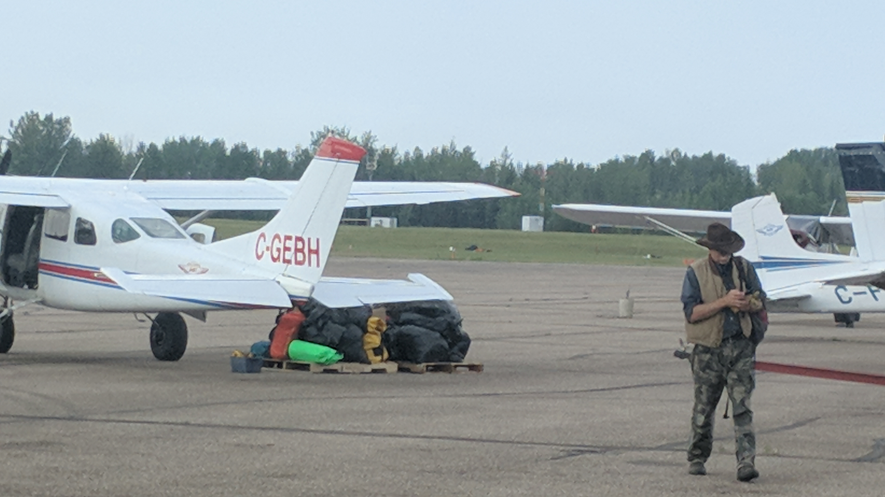_At the airstrip with Wayne Sawchuk_

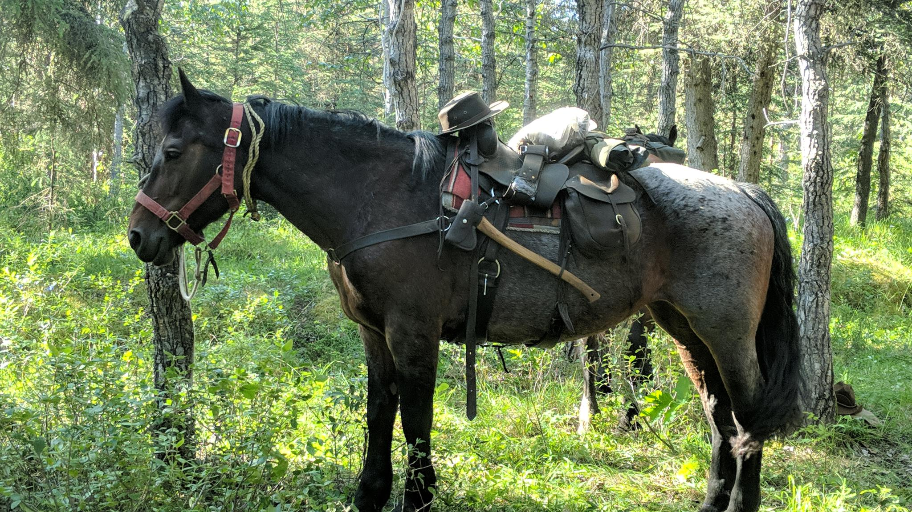_Rosey, Alex's mare, sure-footed, if a stubborn old girl_

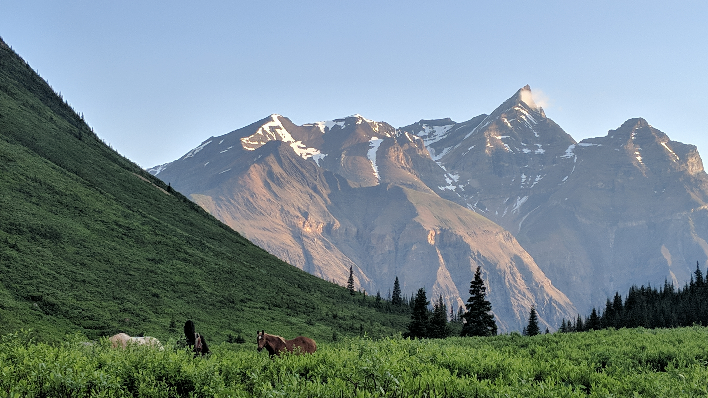_Catching the horses in the morning didn't get much more picturesque than this_

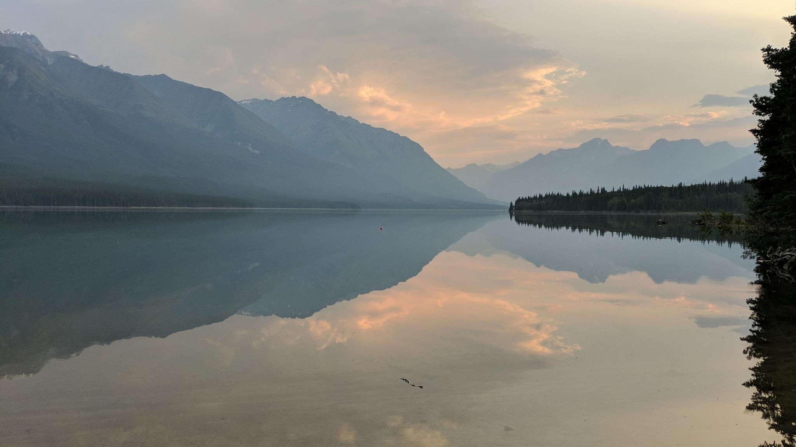_We stayed a extra night to camp on Tuchodi lake to feed up the horses and the sunsets were alright too_

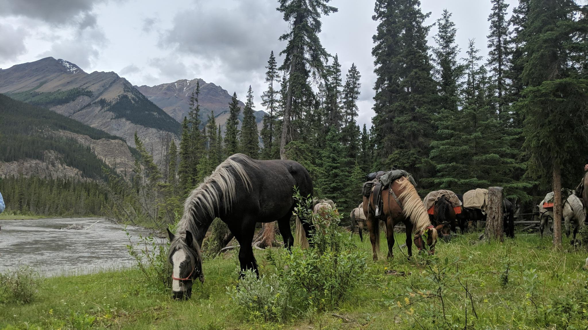_The horses have a lunch break_

_My daily lunch routine_

_A perfect little nest spotted on the riverbank while shoeing a horse, likely ducks_

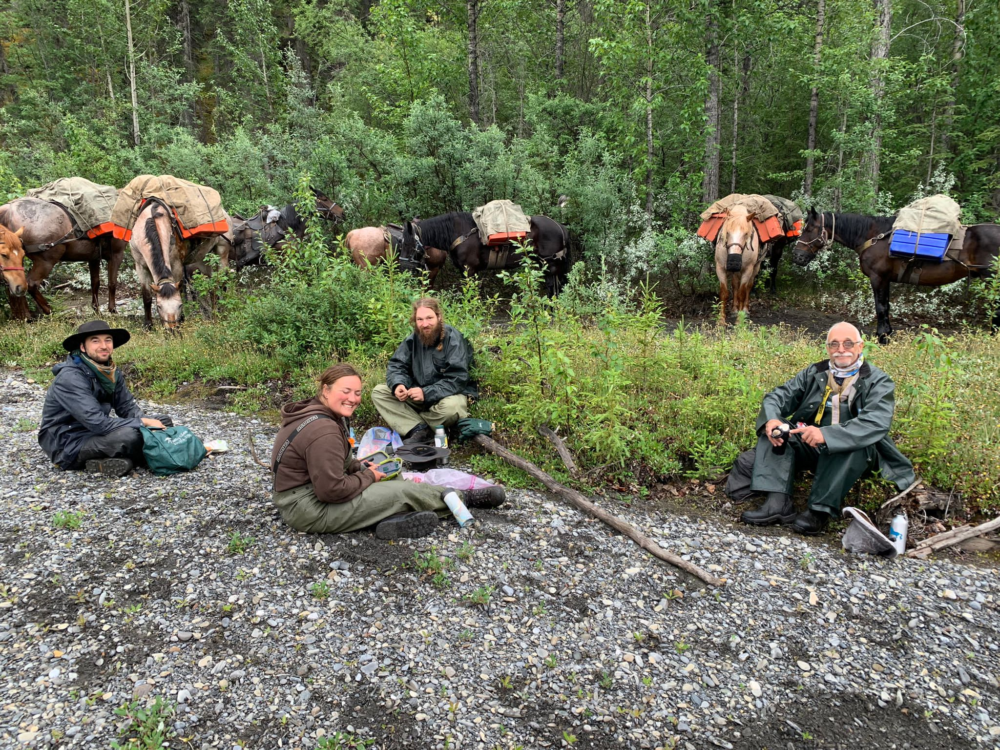_A rainy mornin lunch with the crew, myself, Michelle, Alex and Wayne_

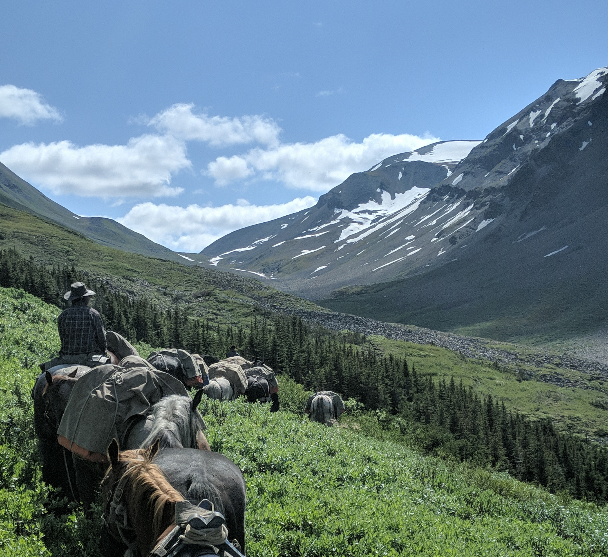_Coming over a pass from the head of the Gatho_

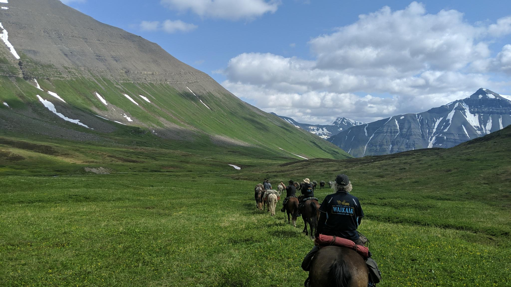_My view most days_

_Just a double water fall on our right there_

  
  <em>A routine river crossing</em>

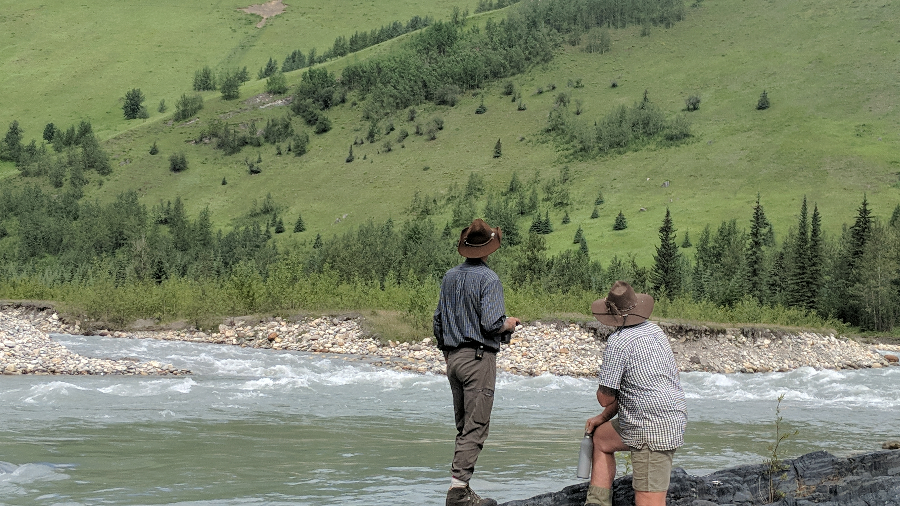_Wayne and Ray are elk spotting_
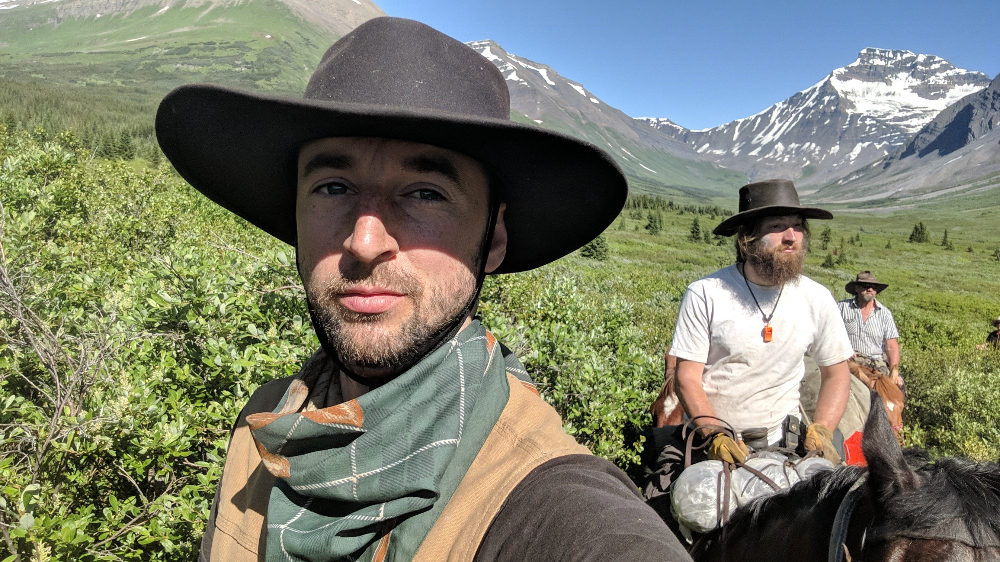_With the gang_
_Our clients ever questing for wildlife views_

  
  <em>Plane day from Big 9 outfitters, at the end of our journey</em>

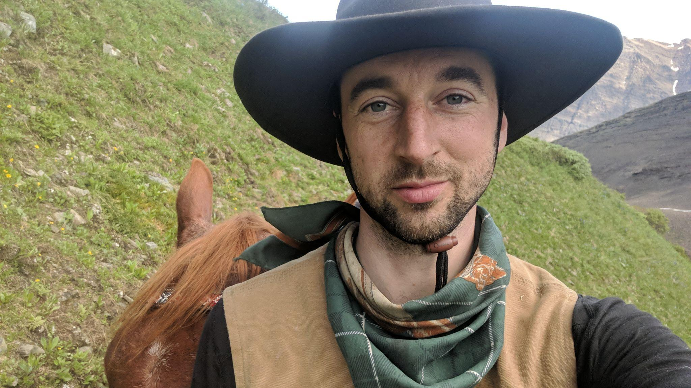_Thanks for checking it out, adios!_
